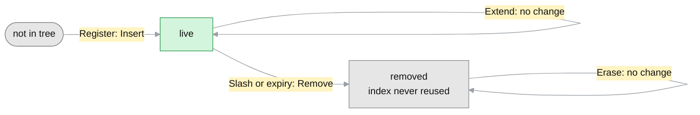
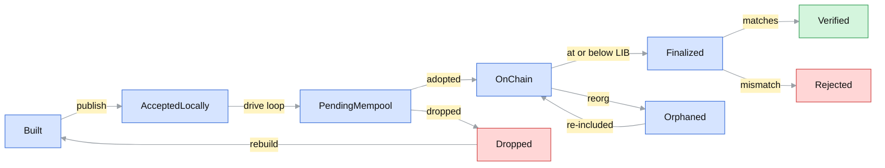
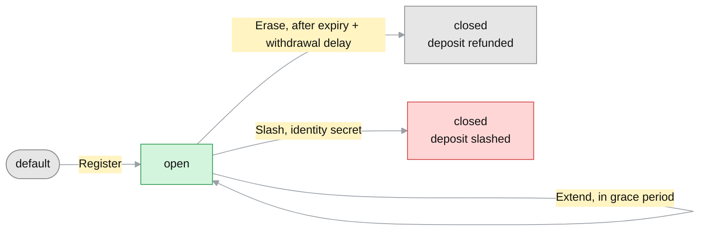

# RLN-MEMBERSHIP-ZONE

| Field | Value |
| --- | --- |
| Name | RLN Membership Zone |
| Slug | TBD |
| Status | raw |
| Category | Standards Track |
| Tags | rln, membership, registry, zone |
| Editor | Vinh Trinh <vinh@status.im> |
| Contributors | |

## Abstract

This document specifies the RLN Membership Zone:
a registry, in the sense of the
[RLN-API](https://lip.logos.co/anoncomms/raw/rln-api.html),
whose membership set is maintained by a dedicated Zone on the Logos Blockchain,
while deposits, refunds and slashing are handled by a registration program
on the Logos Execution Zone (LEZ).

Registration is a single LEZ transaction that deposits for an identity commitment.
A Zone sequencer follows the registration program,
turns its transactions into changes to the membership set,
and publishes them in batches as inscriptions on Bedrock.
Bedrock orders and finalizes these inscriptions, so every reader sees the same change log.
The derivation rules that turn transactions into changes are fixed and deterministic.
Every honest Zone indexer that reads the same finalized batches and LEZ blocks
therefore computes the same membership set and roots.

The RLN Module that RLN-API specifies ("the Module" for short) runs in every user's node.
It reads roots, Merkle proof paths and membership state from a Zone indexer,
and uses this registry through RLN-API unchanged,
under the existing `logos` namespace binding.
The Zone holds no funds and has no general-purpose execution environment.
All funds stay in the registration program.

## Motivation

This draft is written against the current `logos` registry,
the logos-lez-rln implementation (lez-rln below),
and compares with it where that helps a design decision.
The comparisons are temporary.
Once the design decisions are settled and the specification is aligned with RLN-API,
they will be removed, and each repository will implement only its own part.
They appear only in the [Open Questions](#open-questions).

lez-rln keeps the membership set inside LEZ accounts.
Every registration recomputes the rate commitment and every level of the tree
inside the RISC Zero zkVM:

- one registration costs about 9.09M execution gas against `MAX_GAS_EXEC`,
  10M per transaction and per LEZ block, so a LEZ block holds at most one registration;
- at the floor execution base fee (`BASE_FEE_EXEC_MIN`, 8 atomic units per gas)
  its execution fee alone is about 72.7M atomic units;
- every registration exceeds the 5M `TARGET_GAS_EXEC`,
  so sustained registration raises the LEZ base fee for all LEZ users by about 10% per LEZ block;
- the tree is limited to depth 9 (512 leaves over its lifetime) to fit `MAX_GAS_EXEC`,
  which forces a non-standard depth-10 circuit on proof generators
  (the Merkle proof path is padded with one empty sibling).

RLN itself does not need this cost.
A registry needs ordered, available, verifiable changes to its membership set,
which the Logos Blockchain provides to Zones directly,
and the hashing can run outside the zkVM.
Moving the membership set to a Zone removes the hashing from the zkVM,
raises the tree depth to 20, the depth Zerokit ships,
and keeps only the deposit logic on LEZ.

## Semantic

The key words "MUST", "MUST NOT", "REQUIRED", "SHALL", "SHALL NOT",
"SHOULD", "SHOULD NOT", "RECOMMENDED", "MAY", and "OPTIONAL" in this document
are to be interpreted as described in [RFC 2119](https://www.ietf.org/rfc/rfc2119.txt).

## Terminology

Every term not listed here keeps the meaning and spelling of its source:
RLN-API first, then RLN Membership Allocation, RLN-V1 and RLN-V2, the Zerokit-API,
and the Logos Blockchain specifications and code ([References](#references)).

"The Module" is short for the RLN Module that RLN-API specifies; every user node runs its own instance.
"Epoch" is always the RLN epoch, never the Cryptarchia epoch.

This document adds:

| Term | Meaning |
| --- | --- |
| The Zone | The RLN Membership Zone specified here; "a Zone" or "Zones" means any Logos Zone (glossary), LEZ included. |
| Zone channel | The channel of the Zone, written by the Zone sequencers. |
| Batch | The payload of one `CHANNEL_INSCRIBE` in the Zone channel, carrying the membership-set changes of a contiguous range of LEZ blocks, the batch range `[from_lez_block_id, to_lez_block_id]`. |
| Empty batch | A batch without changes. |
| Zone indexer | Any party that reads every batch of the Zone channel, verifies it against LEZ and serves the registry view; distinct from the LEZ Indexer. |
| Zone operator | The party that holds the accredited keys of the Zone channel, runs the Zone sequencers, pays their Mantle Transaction fees and receives `registration_fee` at `operator_account_id` ([LEZ Requirements](#lez-requirements)); one party in this draft ([Q14](#q14-funding-the-zone-m)). |
| LEZ order | The order of LEZ transactions by `block_id`, then by position in the LEZ block. |
| Module clock | The `timestamp` of the latest LEZ block in the Module's view; the clock of membership status. |
| Zone lag | How far the Zone runs behind LEZ: the `timestamp` of the latest finalized LEZ block minus the `timestamp` of LEZ block `to_lez_block_id` of the latest finalized batch. It includes batch finality. |
| Removal lag | How long a removed leaf keeps backing proofs: from the expiry or the double-signal, through the `Slash` when slashing, LEZ finality and the Zone lag, until the last root containing the leaf leaves the valid-root window. |
| Clock jump | A LEZ block whose `timestamp` moves backwards, or forwards by far more than the LEZ block interval. It is possible because the LEZ Sequencer sets each `timestamp` from its own clock and LEZ checks neither order nor step size ([Q10](#q10-clock-jumps-m)). |
| Fail-open, fail-closed | The two Module policies for a Zone sequencer outage: keep every root in the valid-root window (fail-open), or drop roots older than `withdrawal_delay_ms` (fail-closed) ([Q13](#q13-root-age-and-the-removal-lag-m)). |

## Overview

This section shows who takes part and how a membership moves through the system;
the following sections specify each part.

### Assumptions

- Bedrock totally orders and finalizes channel inscriptions and keeps them available.
- LEZ blocks are inscribed on Bedrock in the LEZ channel;
  a LEZ block is finalized once its inscription is.
- Each LEZ block carries a `timestamp` in Unix-epoch milliseconds,
  which the clock program writes to the clock accounts.
  This is the registry's time base, as the `logos` namespace binding (RLN-API Appendix A) requires.
- Rate commitments are `poseidon(identity_commitment, rate_limit)`,
  with Poseidon over BN254 as in the Zerokit-API.
- The membership set is a Merkle tree of depth 20, append-only in leaf indices:
  a removed leaf is set to the empty value and its index is never reused,
  so the leaf capacity is 2^20 memberships over the registry's lifetime.
  The registration program assigns leaf indices and enforces the leaf capacity.
- Only accredited keys write to the Zone channel
  ([Mantle channel operations](https://lip.logos.co/blockchain/raw/bedrock-v1.1-mantle-specification.html));
  anyone reads it.

### Components

| Component | Runs where | Holds | Interacts with |
| --- | --- | --- | --- |
| User interface | the user's node: the Basecamp RLN membership UI, a CLI, or an app such as a Logos Delivery node | nothing RLN-specific | calls its Module through RLN-API (`register`, `generate_proof`, `validate_proof`) |
| Module | inside the user's node | keystore, membership records, registry view (valid-root window, Merkle proof paths, statuses), nullifier log, message-id allocation, a funded account on LEZ (or a membership provider registers on its behalf, see [Module](#module)) | sends `Register`, `Extend` and `Erase` to LEZ and reads its membership account there; reads its registry view from a Zone indexer, or from the Zone channel on Bedrock directly ([Module](#module)) |
| LEZ Sequencer | LEZ | LEZ state and mempool | receives transactions from the Module and the slasher; inscribes each LEZ block in the LEZ channel on Bedrock |
| LEZ Indexer | any host | finalized LEZ blocks, events and accounts | serves finalized LEZ blocks, events and accounts to Zone sequencers, Zone indexers and the Module |
| Registration program | LEZ | configuration account, escrow, treasury, membership accounts | runs when the LEZ Sequencer executes a transaction that calls it, directly or through a chained call |
| Bedrock | Logos Blockchain nodes | the LEZ channel (LEZ blocks) and the Zone channel (batches), totally ordered and finalized up to the latest immutable block (LIB); the notes that pay Mantle Transaction fees | lets anyone read every channel; lets only accredited keys write to their channel |
| Zone sequencer | the Zone operator's hosts, one per accredited key (2-3 keys) | its replica of the membership set, node wallet notes, the batch in flight | reads finalized LEZ blocks; publishes batches to the Zone channel on Bedrock; takes no input from any Module |
| Zone indexer | any host; holds no accredited key | verified membership set, root history `(root_after, to_lez_block_id)` | reads finalized batches from Bedrock and checks each batch range against LEZ; serves the registry view to the Module |
| Slasher | any host | a funded account on LEZ | gets `recovered_secret` from its Module; sends `Slash` to LEZ |

The Module acts as proof generator when it calls `generate_proof`
and as validator when it calls `validate_proof`, as RLN-API calls these roles;
the same Module plays both.
LEZ never reads the Zone and the Zone never writes to LEZ.
Reading LEZ costs no gas, so the registry adds no LEZ load beyond its own transactions.

### A membership's life

The Module generates an identity credential and sends `Register` from its funded account.
The registration program moves the deposit to the escrow
and assigns the next leaf index.
Once the LEZ block holding the `Register` is finalized, a Zone sequencer reads the `Register`,
turns it into an `Insert` and publishes it in a batch on Bedrock.
Once the batch is finalized, every Zone indexer checks it:
it reads the same LEZ blocks, computes the changes and the new root by itself,
and compares them with the batch.
If they match, it serves the new root,
and the membership becomes `MEMBERSHIP_ACTIVE`.
The holder MAY send `Extend` during the grace period.
At expiry the Zone removes the leaf.
After the withdrawal delay the holder sends `Erase` and gets the deposit back.
If the member double-signals, a validator recovers the identity secret
and a slasher sends `Slash`:
the deposit is slashed to the treasury and the Zone removes the leaf.

### Flow

Registration (steps 1-9): a user action reaches the registration program on LEZ, and the Zone turns it into a new root that the Module reads back.

```mermaid
%%{init: {"theme": "base", "flowchart": {"nodeSpacing": 30, "rankSpacing": 50, "padding": 6}, "themeVariables": {"lineColor": "#9aa0a6", "primaryTextColor": "#111111", "edgeLabelBackground": "#ffffff", "fontSize": "15px"}, "themeCSS": "marker { overflow: visible; } .arrowMarkerPath { transform: scale(1.7); transform-origin: 5px 5px; } .edgeLabel, .edgeLabel p, .edgeLabel span { font-size: 12px; line-height: 1.2; }"}}%%
flowchart LR
    APP["Basecamp UI,<br/>CLI, app<br/>(user interface)"] -->|"#nbsp;1. interact#nbsp;"| MOD["Module<br/>(user node)"]
    MOD -->|"#nbsp;2. Register /#nbsp;<br/>#nbsp;Extend / Erase#nbsp;"| LSEQ["LEZ<br/>Sequencer<br/>(LEZ)"]
    LSEQ -->|"#nbsp;3. execute#nbsp;"| PROG["Registration<br/>program<br/>(LEZ)"]
    LSEQ -->|"#nbsp;4. inscribe#nbsp;"| LCH["LEZ channel<br/>(Bedrock)"]
    LCH -->|"#nbsp;5. finalized#nbsp;<br/>#nbsp;LEZ blocks#nbsp;"| ZSEQ["Zone<br/>sequencer<br/>(Zone)"]
    ZSEQ -->|"#nbsp;6. publish#nbsp;<br/>#nbsp;batch#nbsp;"| ZCH["Zone channel<br/>(Bedrock)"]
    ZCH -->|"#nbsp;7. finalized#nbsp;<br/>#nbsp;batches#nbsp;"| IDX["Zone indexer<br/>(Zone)"]
    LCH -.->|"#nbsp;8. re-check#nbsp;<br/>#nbsp;batch range#nbsp;"| IDX
    IDX -->|"#nbsp;9. roots, Merkle proof path, status#nbsp;"| MOD
    linkStyle default stroke-width:2.5px

    classDef ui fill:#1a2826,stroke:#9fbfb3,color:#ffffff
    classDef user fill:#d6e4ff,stroke:#3b6fd8,color:#111111
    classDef lez fill:#d4f5dd,stroke:#2e9b52,color:#111111
    classDef l1 fill:#ffc98f,stroke:#c25e00,color:#111111
    classDef zone fill:#fbcfe8,stroke:#be185d,color:#111111
    class APP ui
    class MOD user
    class LSEQ,PROG lez
    class LCH,ZCH l1
    class ZSEQ,IDX zone
```



Messaging and slashing (steps 10-15): a double-signal reveals the identity secret, a slasher slashes the deposit, and the Zone removes the leaf.

```mermaid
%%{init: {"theme": "base", "flowchart": {"nodeSpacing": 40, "rankSpacing": 55, "padding": 6}, "themeVariables": {"lineColor": "#9aa0a6", "primaryTextColor": "#111111", "edgeLabelBackground": "#ffffff", "fontSize": "15px"}, "themeCSS": "marker { overflow: visible; } .arrowMarkerPath { transform: scale(1.7); transform-origin: 5px 5px; } .edgeLabel, .edgeLabel p, .edgeLabel span { font-size: 12px; line-height: 1.2; }"}}%%
flowchart LR
    SND["Module - proof generator<br/>(user node)"] -->|"#nbsp;10. message + proof#nbsp;"| VAL["Module - validator<br/>(other node)"]
    VAL -->|"#nbsp;11. recovered_secret#nbsp;"| SL["Slasher<br/>(any node)"]
    SL -->|"#nbsp;12. Slash#nbsp;"| PROG["Registration program<br/>(LEZ)"]
    PROG -->|"#nbsp;13. next batch: Remove#nbsp;"| IDX["Zone indexer<br/>(Zone)"]
    IDX -->|"#nbsp;14. new roots#nbsp;"| VAL
    IDX -->|"#nbsp;15. new roots, MEMBERSHIP_SLASHED#nbsp;"| SND
    linkStyle default stroke-width:2.5px

    classDef user fill:#d6e4ff,stroke:#3b6fd8,color:#111111
    classDef lez fill:#d4f5dd,stroke:#2e9b52,color:#111111
    classDef zone fill:#fbcfe8,stroke:#be185d,color:#111111
    class SND,VAL,SL user
    class PROG lez
    class IDX zone
```



| Step | Action | When |
| --- | --- | --- |
| 1 | The user interface (Basecamp UI, CLI or an app) calls the Module through RLN-API. | Whenever the user acts: registers, renews or withdraws a membership. |
| 2 | The Module sends `Register`, `Extend` or `Erase` to the LEZ Sequencer, signed by the funded account (`Register`) or the `holder` (`Extend`, `Erase`). | `Register` once per membership; `Extend` in the grace period; `Erase` after the withdrawal delay. |
| 3 | The LEZ Sequencer executes it with the registration program; for `Register`: the checks, the deposit to the escrow, `registration_fee` to the Zone operator, a new `leaf_index`. | In the same LEZ block. |
| 4 | The LEZ Sequencer inscribes the LEZ block in the LEZ channel on Bedrock. | Every LEZ block. |
| 5 | The Zone sequencer reads the finalized LEZ blocks from the LEZ channel. | Once the LEZ block is finalized, about 60 min on testnet ([Q1](#q1-two-finalities-h)). |
| 6 | The Zone sequencer turns their registration-program transactions into changes and publishes a batch to the Zone channel. | On its turn to write, covering every finalized LEZ block not yet covered. |
| 7 | The Zone indexer reads the finalized batch from the Zone channel. | Once the batch is finalized, about another 60 min on testnet ([Q1](#q1-two-finalities-h)). |
| 8 | The Zone indexer reads the same LEZ blocks, recomputes the changes and the root, and compares them with the batch. | For every batch. |
| 9 | The Zone indexer serves the new roots, Merkle proof paths and statuses; the Module updates its registry view. | In the background, never while validating a message ([Q11](#q11-registry-view-local-tree-and-computing-from-lez-h)). |
| 10 | The sender's Module, as proof generator, sends a message with its RLN proof; another node's Module, as validator, checks it. | Every message. |
| 11 | The validator detects a double-signal and hands `recovered_secret`, the identity secret, to a slasher, or sends the `Slash` itself. | When a nullifier repeats with a different `share_x`. |
| 12 | The slasher sends `Slash{identity_secret}`; the registration program slashes the deposit to the treasury. | As soon as the slasher has the identity secret. |
| 13 | Steps 4-8 run again: the next batch carries `Remove{leaf_index}` for the slashed leaf. | In the next batch. |
| 14 | The Zone indexer serves the new roots to the validator; old roots that still contain the leaf stay valid until they leave the valid-root window ([Q13](#q13-root-age-and-the-removal-lag-m)). | Once that batch is finalized. |
| 15 | The Zone indexer serves the new roots and `MEMBERSHIP_SLASHED` to the violator's Module. | Once that batch is finalized. |

The following sections specify the [Zone Sequencer](#zone-sequencer) (steps 5-6)
and the [Zone Indexer](#zone-indexer) (steps 7-9),
then what the Zone requires from LEZ ([LEZ Requirements](#lez-requirements), steps 2-4)
and what the Module reads ([Module](#module), steps 1 and 9-15).
The [Open Questions](#open-questions) close the document.

## Zone Sequencer

This section specifies what a Zone sequencer publishes and how it derives it from LEZ.

### Batch format

```protobuf
syntax = "proto3";

message Batch {
  uint64          from_lez_block_id = 1;  // first LEZ block_id covered, inclusive
  uint64          to_lez_block_id   = 2;  // last LEZ block_id covered, inclusive
  repeated Change changes           = 3;  // in derivation-rule order
  bytes           root_after        = 4;  // 32 bytes, little-endian, membership-set root after the changes
}

message Change {
  oneof kind {
    Insert insert = 1;
    Remove remove = 2;
  }
}
message Insert { uint64 leaf_index = 1; bytes rate_commitment = 2; }  // 32 bytes, little-endian
message Remove { uint64 leaf_index = 1; }
```

One batch per `CHANNEL_INSCRIBE`, carried by one Mantle Transaction.
`Insert` and `Remove` are the two tree operations of lez-rln's Merkle program;
a batch carries only what changes the tree.
Why a leaf was removed, and each leaf's expiry, are read from LEZ.

### Derivation rules

The Zone sequencer and every Zone indexer apply the same rules.
For every finalized LEZ block in the batch range, in order,
and every successful registration-program transaction in that LEZ block, in LEZ order ([Q3](#q3-chained-calls-in-the-derivation-rules-h)):

- `Register` produces `Insert{leaf_index, rate_commitment}`,
  with the membership account's `leaf_index` and `poseidon(id_commitment, rate_limit)`.
- `Slash` produces `Remove{leaf_index}`, if the leaf is live.
  A `Slash` after the leaf expired produces no change,
  but the Module still reports `MEMBERSHIP_SLASHED` ([Membership status](#membership-status)).
- `Extend` produces no change; the Zone only records the new `expiry_timestamp_ms`.
- `Erase` produces no change:
  it needs `now >= expiry_timestamp_ms + withdrawal_delay_ms`,
  so the expiry step of an earlier LEZ block has already removed the leaf.

After the transactions of a LEZ block, every live leaf whose `expiry_timestamp_ms` is at or below
that LEZ block's `timestamp` produces `Remove{leaf_index}`, in increasing leaf index.
A leaf expires at most once ([Q10](#q10-clock-jumps-m)).



### Publishing

- A Zone sequencer SHOULD publish one batch per turn to write,
  covering every finalized LEZ block not yet covered ([Q4](#q4-empty-batches-and-zone-sequencer-delay-m)).
- A batch covers whole LEZ blocks.
  It MAY end at an earlier LEZ block boundary when the changes would exceed one inscription
  (1,835,008 bytes); the next batch continues from there ([Q10](#q10-clock-jumps-m)).
- An empty batch is valid; it advances `to_lez_block_id`.
- Each batch in flight holds one node wallet note until its Mantle Transaction is in a Bedrock block.
  A Zone sequencer SHOULD therefore keep at most one batch in flight,
  or split its node wallet into one note per batch it keeps in flight.
- A Zone sequencer MUST keep driving the Zone SDK between publishes
  and MUST NOT send several publishes back to back.
- Recovery after a restart, a dropped batch, a switch to the next Zone sequencer
  or a lost key is open ([Q5](#q5-zone-sequencer-recovery-m)).

A batch moves through the Zone SDK `TxStatus` values plus four states of this document
(Built, Verified, Rejected, Dropped).
Zone indexers act only on `Finalized` batches.



## Zone Indexer

This section specifies how anyone checks the batches, and what a Zone indexer serves.

A Zone indexer MUST reject a batch that violates check 3, 4, 5 or 7,
and every batch after it ([Q2](#q2-a-rejected-batch-halts-every-zone-indexer-h)).
Items 1, 2 and 6 hold by design and configuration.

1. **No funds.** The Zone holds no funds and keeps no ledger.
2. **Derived from LEZ.** The membership set is determined only by the
   registration-program transactions in finalized LEZ blocks, in LEZ order.
3. **Completeness.** Batch `n` covers exactly `[to_lez_block_id(n-1) + 1, to_lez_block_id(n)]`
   and contains exactly the changes the derivation rules give for that range.
   An omission is provable censorship.
4. **Finality.** Only finalized LEZ blocks are covered ([Q1](#q1-two-finalities-h)).
5. **Root.** `root_after` equals the root obtained by applying the batch.
6. **Withdrawal delay.** `withdrawal_delay_ms` is at least LEZ finality,
   plus the maximum tolerated Zone lag,
   plus the longest time a root stays in the valid-root window,
   so a rate commitment is never usable after its deposit has left the escrow ([Q13](#q13-root-age-and-the-removal-lag-m)).
7. **Uniqueness.** At most one live leaf per identity commitment.

For each finalized batch, a Zone indexer:

- checks that `from_lez_block_id` follows the previous `to_lez_block_id`
  and that LEZ block `to_lez_block_id` is finalized;
- reads the registration-program transactions and the `timestamp` of every LEZ block in the batch range,
  from a LEZ Indexer or from the LEZ channel;
- computes the changes with the derivation rules and compares them with `changes`;
- applies them, compares the root with `root_after`,
  and appends `(root_after, to_lez_block_id)` to its root history.

An empty batch repeats the current root with a newer `to_lez_block_id`,
which refreshes the root's age.
A Zone indexer serves the root history, the Merkle proof path of a leaf and whether a leaf is live.
The API is open ([Q11](#q11-registry-view-local-tree-and-computing-from-lez-h)).

## LEZ Requirements

The Zone depends on LEZ and on a registration program on LEZ.
This document does not specify that program; it requires the following.

- **Finality.** LEZ blocks are inscribed in the LEZ channel and finalized with their inscription.
- **Time.** Every LEZ block carries a `timestamp` in Unix-epoch milliseconds.
  The registration program reads `now` from the clock account `CLOCK_01`,
  which holds the `timestamp` of the previous LEZ block ([Q10](#q10-clock-jumps-m)).
- **Custody, no tree.** The registration program holds every deposit in an escrow that only it can spend,
  and keeps no Merkle tree.
- **Configuration.** A configuration account, `ConfigState`, is the anchor of the registry.
  It holds `zone_channel_id`, `treasury_account_id`, `operator_account_id`, the next free leaf index
  and the parameters: rate-limit bounds, `price_per_unit`, `registration_fee`, active-duration bounds,
  `grace_period_duration_ms`, `withdrawal_delay_ms` (at least the bound in [Invariant 6](#zone-indexer))
  and `epoch_size_sec` ([Q8](#q8-governance-of-configstate-m)).
- **Memberships.** One membership account per identity commitment holds
  `leaf_index`, `rate_limit`, `expiry_timestamp_ms`, `holder` and `deposit_amount`.
  A closed membership account never opens again, so an identity commitment registers at most once.
- **Leaf indices.** `Register` assigns the next free leaf index; indices are never reused,
  and `Register` fails once 2^20 are used ([Q6](#q6-capacity-h)).
- **Visibility.** Every successful action, with the fields the derivation rules use,
  can be read from finalized LEZ blocks ([Q3](#q3-chained-calls-in-the-derivation-rules-h)).



| Action | Signer | Allowed when | Effect |
| --- | --- | --- | --- |
| `Register{id_commitment, rate_limit, expiry_timestamp_ms}` | funded account | within the `ConfigState` bounds; membership account default; leaf capacity left | deposit `rate_limit × price_per_unit` to the escrow, `registration_fee` to `operator_account_id` ([Q14](#q14-funding-the-zone-m)); `holder` = signer; next leaf index |
| `Extend{id_commitment, expiry_timestamp_ms}` | `holder` | open; `now` in the grace period; new expiry later and within `max_active_duration_ms` of `now` | new expiry |
| `Erase{id_commitment}` | `holder` ([Q7](#q7-only-the-holder-can-send-erase-h)) | open; `now >= expiry_timestamp_ms + withdrawal_delay_ms` | deposit refunded to `holder`; closed |
| `Slash{identity_secret}` | anyone | membership account for `poseidon(identity_secret)` open | deposit to `treasury_account_id` ([Q14](#q14-funding-the-zone-m)); closed |

## Module

This section states what the Module reads from each component and how it reports it through RLN-API.
Everything not stated here is as in RLN-API and its `logos` namespace binding (RLN-API Appendix A).

### What the Module reads

| From | Reads | Used for |
| --- | --- | --- |
| LEZ | its membership account (open or closed, `leaf_index`, `expiry_timestamp_ms`, `holder`), `ConfigState`, the clock | membership status, when to send `Extend` and `Erase`, checking `register` arguments |
| A Zone indexer, or the Zone channel on Bedrock | Verified roots with their `to_lez_block_id`, its Merkle proof path, whether its leaf is live | valid-root window, `generate_proof` |

The Module chooses how far it trusts the second row:
it runs a Zone indexer itself;
or it reads batch roots from the Zone channel and trusts only that an accredited key signed them;
or it queries one Zone indexer ([Q11](#q11-registry-view-local-tree-and-computing-from-lez-h)).

For the `logos` binding:
the anchor account is `ConfigState`, and there are no tree accounts;
`funding_holding_account_id` pays the deposit and `registration_fee`;
the registry-specific option `active_duration_ms` defaults to `max_active_duration_ms`;
the Module configuration names LEZ access and one or more Zone indexer endpoints.

Under direct registration the Module sends `Register` with
`expiry_timestamp_ms` = Module clock + `active_duration_ms`, plus a margin for the inclusion delay.
Under delegated registration the membership provider sends an ordinary `Register`
from its own funded account and becomes `holder`; the Zone does not distinguish it ([Q15](#q15-smaller-points-l)).

### Membership status

The grace period is `[expiry_timestamp_ms - grace_period_duration_ms, expiry_timestamp_ms)`.

| # | Membership account | Leaf in the Module's registry view | Module clock | `MembershipStatus` |
| --- | --- | --- | --- | --- |
| S1 | default, no local record | not in tree | | `MEMBERSHIP_UNKNOWN` |
| S2 | default, `Register` sent | not in tree | | `MEMBERSHIP_PENDING` |
| S3 | open | not in tree yet (Zone lag) | | `MEMBERSHIP_PENDING` |
| S4 | default after the confirmation window | not in tree | | `MEMBERSHIP_FAILED` |
| S5 | open | live | before the grace period | `MEMBERSHIP_ACTIVE` |
| S6 | open | live | in the grace period | `MEMBERSHIP_GRACE_PERIOD` |
| S7 | open | live or removed `EXPIRED` | from `expiry_timestamp_ms` until `expiry_timestamp_ms + withdrawal_delay_ms` | `MEMBERSHIP_EXPIRED` |
| S8 | open | removed `EXPIRED` | from `expiry_timestamp_ms + withdrawal_delay_ms` | `MEMBERSHIP_ERASED_AWAITS_WITHDRAWAL` |
| S9 | closed by `Erase` | removed | | `MEMBERSHIP_ERASED` |
| S10 | closed by `Slash` | live (Zone lag) or removed | | `MEMBERSHIP_SLASHED` |
| S11 | open, `holder` is neither its funded account nor its membership provider's | any | | not covered ([Q9](#q9-foreign-holder-m)) |

The Module generates proofs only in S5 and S6.
An open membership account without a leaf yet stays `MEMBERSHIP_PENDING`,
so the confirmation window only needs to cover LEZ inclusion and LEZ finality ([Q1](#q1-two-finalities-h)).
The Module tells S9 from S10 by the LEZ transaction that closed the account; batches do not carry it.

## Open Questions

Questions are grouped by the part they concern, not by severity.
H blocks a sound deployment, M must be settled before implementation, L is minor.
Edge cases whose handling is not settled are listed here too.

| # | Part | Sev | Question |
| --- | --- | --- | --- |
| [Q1](#q1-two-finalities-h) | Zone | H | Two finalities make registration take about 2 h |
| [Q2](#q2-a-rejected-batch-halts-every-zone-indexer-h) | Zone | H | One Rejected batch halts every Zone indexer forever |
| [Q3](#q3-chained-calls-in-the-derivation-rules-h) | Zone | H | The derivation rules are ambiguous for chained calls |
| [Q4](#q4-empty-batches-and-zone-sequencer-delay-m) | Zone | M | Empty batches every turn; no bound on Zone sequencer delay |
| [Q5](#q5-zone-sequencer-recovery-m) | Zone | M | Zone sequencer outage, recovery and key loss |
| [Q6](#q6-capacity-h) | LEZ | H | No total rate limit, and a cheap way to exhaust the leaf capacity |
| [Q7](#q7-only-the-holder-can-send-erase-h) | LEZ | H | Only the holder can send `Erase` |
| [Q8](#q8-governance-of-configstate-m) | LEZ | M | No governance of `ConfigState` |
| [Q9](#q9-foreign-holder-m) | LEZ | M | A foreign `holder` registers a victim's identity commitment first |
| [Q10](#q10-clock-jumps-m) | LEZ | M | LEZ timestamps can jump backwards or far forwards |
| [Q11](#q11-registry-view-local-tree-and-computing-from-lez-h) | Module | H | No Zone indexer API; the Module could keep its own tree and compute it from LEZ |
| [Q12](#q12-clock-and-sides-of-membership-status-m) | Module | M | Which clock and which side decide membership status |
| [Q13](#q13-root-age-and-the-removal-lag-m) | Module | M | A removed leaf keeps backing proofs; long outages force fail-open or fail-closed |
| [Q14](#q14-funding-the-zone-m) | Funding | M | Who pays the Mantle Transaction fees, and where slashed deposits go |
| [Q15](#q15-smaller-points-l) | All | L | Smaller points |

### Q1. Two finalities (H)

**Problem.** Registration waits for LEZ finality and then batch finality,
each about 60 min on testnet (LIB is about 120 Bedrock blocks of 30 s behind the tip),
so `register` to `MEMBERSHIP_ACTIVE` takes about 2 h; lez-rln takes one LEZ block.
The confirmation window of logos-rln-modules is 300 s,
so a Module reading only finalized LEZ state would report every registration `MEMBERSHIP_FAILED`.

**Proposal.** Replace [Invariant 4](#zone-indexer):
a batch MAY cover a LEZ block once that LEZ block's inscription precedes the batch on the same Bedrock chain,
so batch finality implies LEZ finality.
The Module MAY act on adopted batches (Zone SDK `OnChain`) as a trust choice,
giving `MEMBERSHIP_ACTIVE` within minutes.
The confirmation window is set per registry.

### Q2. A Rejected batch halts every Zone indexer (H)

**Problem.** One Rejected batch halts every Zone indexer forever,
so one bug, or one compromised accredited key publishing garbage, ends the registry.

**Proposal.** A Rejected batch is a no-op:
Zone indexers keep it as evidence and verify the next batch that continues from the last Verified `to_lez_block_id`.
Censorship stays provable, and a Rejected batch only delays the registry.

### Q3. Chained calls in the derivation rules (H)

**Problem.** The derivation rules read "successful registration-program transactions".
A `Register` reached through a chained call from another program is ambiguous.

**Proposal.** Base the derivation rules on registration-program events
(`Registered{id_commitment, rate_limit, expiry_timestamp_ms, leaf_index}`, `Extended`, `Erased`, `Slashed`)
in LEZ order, emitted as `ProgramEvent`s, as the bridge program does (`bridge::Deposit`).

### Q4. Empty batches and Zone sequencer delay (M)

**Problem.** An empty batch every turn to write costs a Mantle Transaction fee each time.
A Zone sequencer can delay a change for as long as it likes;
the Zone lag is public, but nothing bounds it.

**Proposal.** Publish a batch when there are changes,
and an empty batch only after `heartbeat_ms` without one
(below `withdrawal_delay_ms` under fail-closed, [Q13](#q13-root-age-and-the-removal-lag-m)).
A Zone sequencer SHOULD publish within `max_delay_ms` of the first unpublished change.

### Q5. Zone sequencer recovery (M)

**Problem.** A Zone sequencer outage stops insertions and removals,
but loses no data or funds, and existing memberships keep backing proofs.
Unspecified: recovery after a restart or a dropped batch,
the switch to the next Zone sequencer in round-robin,
and the loss of all accredited keys, which needs a new Zone channel and a new `zone_channel_id` ([Q8](#q8-governance-of-configstate-m)).

**Proposal.** Run 2-3 accredited keys on separate hosts with round-robin and `posting_timeout` for failover.
`from_lez_block_id` always follows from the last batch on the Zone channel,
which a Zone sequencer reads as a Zone indexer does.
After a key loss, anyone rebuilds the membership set from Bedrock and the registry restarts on a new Zone channel.

### Q6. Capacity (H)

**Problem.** There is no total rate limit, so network load is unbounded;
lez-rln has one (`max_total_rate_limit`).
The leaf capacity of 2^20 can be exhausted for only `2^20 × (registration_fee + LEZ transaction fee)`,
since deposits are refunded and leaf indices are never reused.

**Proposal.** Add `max_total_rate_limit` and `current_total_rate_limit` to `ConfigState`,
checked by `Register` and decremented by `Erase` and `Slash`.
Price `registration_fee` against the leaf capacity,
and deploy a new registry when the leaf capacity is reached.

### Q7. Only the holder can send `Erase` (H)

**Problem.** A deposit whose holder never sends `Erase` stays in the escrow forever,
with its share of the total rate limit ([Q6](#q6-capacity-h)).
lez-rln's `Erase` is permissionless and refunds the recorded `holder`.

**Proposal.** Make `Erase` permissionless, still refunding `holder`,
and require a public account as `holder`,
since a refund to a private account id goes to a public account that no key can spend.

### Q8. Governance of `ConfigState` (M)

**Problem.** Nobody is named to set or change `ConfigState`,
to control `treasury_account_id` and `operator_account_id`,
or to replace `zone_channel_id` after the accredited keys are lost.
Open memberships follow the current durations.

**Proposal.** Store `grace_period_duration_ms` and `withdrawal_delay_ms` in each membership account at `Register`.
Either name an admin, or make `ConfigState` immutable and deploy a new registry on change.

### Q9. Foreign holder (M)

**Problem.** Anyone can `Register` a victim's identity commitment first.
The victim's `Register` then reverts permanently, and the attacker is `holder`.

**Proposal.** The victim's Module treats a membership account whose `holder`
is neither its funded account nor its membership provider's account as absent,
reports `MEMBERSHIP_FAILED` after the confirmation window,
and registers again with a new identity credential.

### Q10. Clock jumps (M)

**Problem.** The LEZ Sequencer sets each `timestamp` from its own clock,
and LEZ checks neither order nor step size.
A backward jump cannot revive a membership, since a leaf expires at most once,
but it can let `Extend` succeed on LEZ for a removed leaf, which only delays the refund.
A forward jump shortens memberships and their withdrawal delay,
and can expire so many leaves in one LEZ block that its changes exceed one inscription,
which a batch cannot split.

**Proposal.** Ask LEZ to require increasing timestamps with a bounded step.
In the Zone, cap the expiry `Remove`s per LEZ block and carry the rest forward,
or let a batch continue a LEZ block.

### Q11. Registry view: local tree and computing from LEZ (H)

**Problem.**

- The Zone indexer API is unspecified,
  so a Module and a Zone indexer built by different teams cannot interoperate.
- Asking a Zone indexer for a Merkle proof path reveals the membership,
  and a Module that queries one Zone indexer trusts it fully.
- The membership set is derived from LEZ alone ([Invariant 2](#zone-indexer)),
  yet the Module, also as a validator, waits for a batch before it sees a removal.

**Proposal.** The Module maintains the tree itself from batches read on Bedrock
(20 hashes per change, about 64 MB at 2^20 leaves) and uses a Zone indexer only for status;
or this document specifies a minimal API.
In addition, a validator with a local tree follows registration-program events on LEZ ([Q3](#q3-chained-calls-in-the-derivation-rules-h)),
applies a removal as soon as it sees it,
and drops every root older than that removal, so a slashed leaf stops validating within one LEZ block.
Batches still give light Modules verified roots, evidence of censorship and a common reference.

**Open points.** The cost of following LEZ from the program's first LEZ block;
honest proofs on a dropped root must be generated again;
whether insertions should be computed this way too ([Q1](#q1-two-finalities-h));
how much of the Zone is still needed.

### Q12. Clock and sides of membership status (M)

**Problem.** Membership status uses the Module clock, which lags behind LEZ,
and LEZ and the Zone can disagree for a while after any change.

**Proposal.** A membership becomes usable only when both sides agree
(membership account open, Module clock before `expiry_timestamp_ms`, leaf live in a root of the valid-root window),
and stops being usable as soon as either side says so.
The [membership status](#membership-status) table already follows this rule (S7, S10).
The open point is RLN-API's wording, which describes `MEMBERSHIP_SLASHED` as "removed by slashing".

### Q13. Root age and the removal lag (M)

**Problem.**

- A proof shows validators the root, the nullifier and the shares, but not the leaf,
  so a removed leaf keeps backing proofs for the removal lag, which nothing bounds.
  After a `Slash` an honest Module stops at once,
  but the identity secret is public, so anyone can use the membership up to `rate_limit` messages per epoch
  until the removal is finalized and the old root leaves the valid-root window.
- A valid-root window bounded only by its length never moves while the membership set does not change
  (lez-rln keeps 4 previous roots).
- [Invariant 6](#zone-indexer) does not count the time to detect a double-signal.
- A Zone sequencer outage longer than `withdrawal_delay_ms` forces a choice.
  Fail-open keeps availability, but a holder who sent `Erase` may keep proving with an old root.
  Fail-closed never backs a proof with a withdrawn deposit, but a longer outage stops all proofs.
  A deny list at validators is impossible, since proofs hide the rate commitment.

**Proposal.** Bound the valid-root window by root age (`max_root_age_ms`) as well as by length,
and choose the window length, `heartbeat_ms` and `withdrawal_delay_ms` from the removal lag.
[Q11](#q11-registry-view-local-tree-and-computing-from-lez-h) describes how validators could remove the lag.
The choice between fail-open and fail-closed is open.

### Q14. Funding the Zone (M)

**Problem.**

- The Zone operator pays the Mantle Transaction fee of every batch from its node wallets,
  about `(59 + 590) × execution_gas_base_price + (632 + 45 × N) × permanent_storage_gas_price` for `N` insertions
  ([Execution Market](https://lip.logos.co/blockchain/raw/execution-market.html),
  [Storage Markets](https://lip.logos.co/blockchain/raw/storage-markets.html)),
  about 58 Bedrock fee units per membership at floor prices and `N = 100`.
- This draft reimburses it with a non-refundable `registration_fee` credited to one `operator_account_id`.
  lez-rln charges no such fee, RLN-API Appendix A has the funded account pay only `rate_limit × price_per_unit`,
  and the Zone sequencers may belong to different parties.
- `registration_fee` is fixed on LEZ while Bedrock gas prices change,
  the bridge `Withdraw` from LEZ to Bedrock is disabled,
  and LEZ counts 10^9 atomic units per LGO while Bedrock prices gas in LGO with no sub-unit.
- Removals cost Bedrock bytes but pay nothing,
  and fees above the Zone SDK's `max_tx_fee` stall batches.
- Slashed deposits go to `treasury_account_id`, which nobody is named to hold (LEZ cannot burn).
- There is no slasher reward. With one, slashers would compete,
  and the LEZ Sequencer could copy a pending `Slash` and send it first.

**Proposal.** Phase 1: the Zone operator funds its node wallets directly.
Phase 2: `registration_fee`, and slashed deposits minus an optional slasher reward
(`slasher_reward_percent`), accrue to `operator_account_id`
and are moved through the bridge `Withdraw` to top up the node wallets,
as in the [Logos Oracle Zone](https://lip.logos.co/anoncomms/raw/logos-oracle-zone.html).

**Open points.** Whether to charge a fee at all;
one operator account or a share per Zone sequencer;
who sets `operator_account_id` and `treasury_account_id` ([Q8](#q8-governance-of-configstate-m)).

### Q15. Smaller points (L)

| Point | Proposal |
| --- | --- |
| A reverted `Register` is visible immediately, but RLN-API allows `MEMBERSHIP_FAILED` only after the confirmation window. | Propose an RLN-API change allowing `MEMBERSHIP_FAILED` on an observed revert. |
| RLN-API names the identity commitment the only credential-derived value in the registry, but its `register` text says only the rate commitment is submitted. | Align the RLN-API text with the `logos` binding. |
| Under delegated registration the membership provider is `holder`, so the client cannot send `Extend` or `Erase`. | Leave to RLN Membership Allocation. |
| lez-rln's `ForceExpire` (start the grace period now) has no counterpart. | Decide whether it is needed. |
| Poseidon2 for the membership set. | Switch once Zerokit 3.1.0, matching circuits, the Module and the `Slash` check all use it. |

## Copyright

Copyright and related rights waived via [CC0](https://creativecommons.org/publicdomain/zero/1.0/).

### References

- [RLN-API](https://lip.logos.co/anoncomms/raw/rln-api.html)
- [RLN Membership Allocation](https://lip.logos.co/anoncomms/raw/rln-membership-service.html)
- [32/RLN-V1](https://github.com/logos-co/logos-lips/blob/master/docs/anoncomms/draft/32/rln-v1.md)
- [RLN-V2](https://lip.logos.co/anoncomms/raw/rln-v2.html)
- [Zerokit-API](https://lip.logos.co/anoncomms/raw/zerokit-api.html)
- [Logos Oracle Zone](https://lip.logos.co/anoncomms/raw/logos-oracle-zone.html)
- [Logos glossary](https://docs.logos.co/get-started/glossary)
- [Bedrock v1.1 Mantle specification](https://lip.logos.co/blockchain/raw/bedrock-v1.1-mantle-specification.html)
- [Cryptarchia v1](https://lip.logos.co/blockchain/raw/cryptarchia-v1-protocol.html)
- [Storage Markets](https://lip.logos.co/blockchain/raw/storage-markets.html)
- [Execution Market](https://lip.logos.co/blockchain/raw/execution-market.html)
- [LEE v0.3 specification](https://lip.logos.co/blockchain/raw/lez/lee-v0.3-specifications.html)
- [Zone SDK](https://github.com/logos-blockchain/logos-blockchain/tree/0.3.0/zone-sdk)

### Informative (draft only)

Implementations this draft compares with; removed once the design decisions are settled.

- [logos-lez-rln](https://github.com/logos-co/logos-lez-rln) (lez-rln)
- [logos-rln-modules](https://github.com/logos-co/logos-rln-modules)
