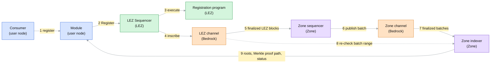
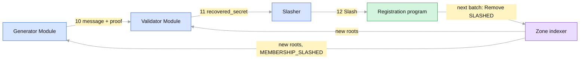
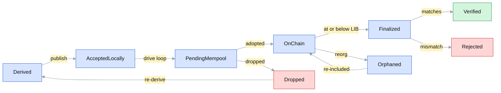
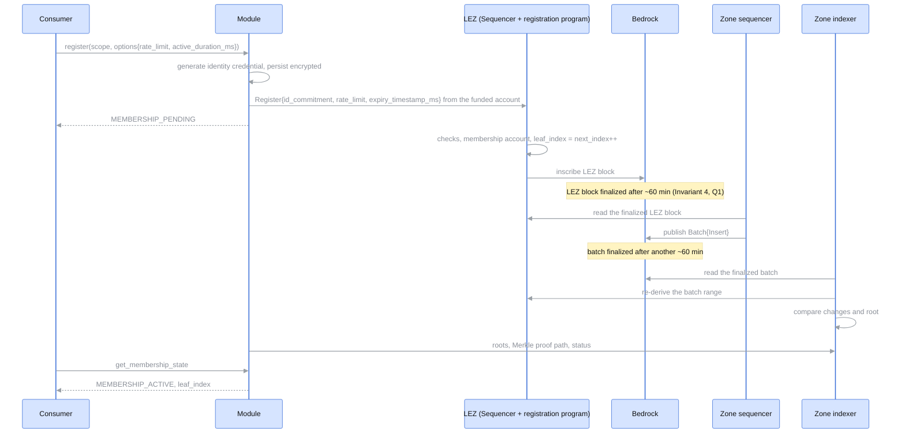
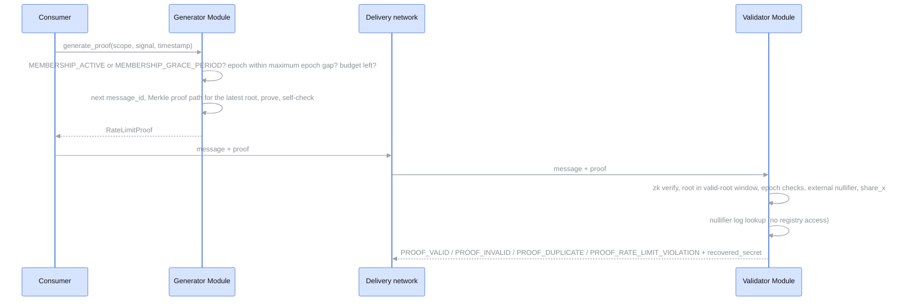
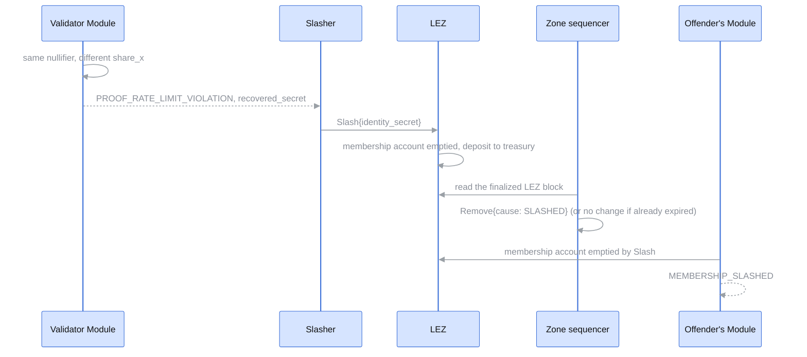

# RLN-MEMBERSHIP-ZONE

| Field | Value |
| --- | --- |
| Name | RLN Membership Zone |
| Slug | TBD |
| Status | raw |
| Category | Standards Track |
| Tags | rln, membership, registry, zone |
| Editor | Vinh Trinh <vinh@status.im> |
| Contributors | |

## Abstract

This document specifies the RLN Membership Zone:
a registry, in the sense of the
[RLN-API](https://lip.logos.co/anoncomms/raw/rln-api.html),
whose membership set is maintained by a dedicated Zone on the Logos Blockchain,
while deposits, refunds and slashing are anchored in a registration program
on the Logos Execution Zone (LEZ).

Registration is a single LEZ transaction that deposits for an identity commitment.
A Zone sequencer follows the registration program,
derives the corresponding changes to the membership set,
and publishes them in batches as inscriptions on Bedrock.
Bedrock totally orders and finalizes these inscriptions,
which makes the change log immutable and identical for every reader.
Because the log is immutable and the derivation is fixed and deterministic,
every honest Zone indexer that reads the same finalized batches and the same finalized LEZ blocks
computes the same membership set and the same roots.

Modules read roots, Merkle proof paths and membership state from a Zone indexer,
and use this registry through RLN-API unchanged,
under the existing `logos` namespace binding.
The Zone holds no funds and no general-purpose execution environment;
its economic security lives in the registration program.

## Motivation

The current `logos` registry, the
[logos-lez-rln](https://github.com/logos-co/logos-lez-rln) registration program
(lez-rln below),
keeps the membership set inside LEZ accounts.
Every registration recomputes the rate commitment and every level of the tree
inside the RISC Zero zkVM:

- one registration costs about 9.09M execution gas against `MAX_GAS_EXEC`,
  10M per transaction and per LEZ block, so a LEZ block holds at most one registration;
- at the floor execution base fee (`BASE_FEE_EXEC_MIN`, 8 atomic units per gas)
  its execution fee alone is about 72.7M atomic units;
- every registration exceeds the 5M `TARGET_GAS_EXEC`,
  so sustained registration raises the LEZ base fee for all LEZ users by about 10% per LEZ block;
- the tree is limited to depth 9 (512 leaves over its lifetime) to fit `MAX_GAS_EXEC`,
  which forces a non-standard depth-10 circuit on proof generators.

None of this cost is intrinsic to RLN.
A registry needs ordered, available, verifiable changes to its membership set,
which the Logos Blockchain provides to Zones directly,
while hashing can run natively.
Moving the membership set to a Zone removes the in-zkVM hashing,
lifts the size limit to the depth Zerokit ships (20),
and leaves LEZ with only the deposit logic.

## Semantic

The key words "MUST", "MUST NOT", "REQUIRED", "SHALL", "SHALL NOT",
"SHOULD", "SHOULD NOT", "RECOMMENDED", "MAY", and "OPTIONAL" in this document
are to be interpreted as described in [RFC 2119](https://www.ietf.org/rfc/rfc2119.txt).

## Terminology

Terms defined elsewhere keep the meaning and spelling of their source:

- [RLN-API](https://lip.logos.co/anoncomms/raw/rln-api.html):
  Module, Consumer, application, registry, `registry_id`, `rln_identifier`,
  scope (`MembershipScope`), identity credential, identity secret (returned as `recovered_secret`),
  identity commitment, rate commitment (`poseidon(identity_commitment, rate_limit)`), `rate_limit`,
  deposit, direct and delegated registration, funded account,
  epoch and epoch size, valid-root window and valid-root window length, maximum epoch gap,
  confirmation window, withdrawal, registry view, `membership_hash`,
  the `MembershipStatus`, `ProofVerdict` and `RLN_ERR_*` values,
  and, from its `logos` namespace binding (Appendix A),
  registration program, configuration account, membership accounts, treasury,
  `funding_holding_account_id`, `price_per_unit`, active duration, grace period
  and on-chain clock account.
- [32/RLN-V1](https://github.com/logos-co/logos-lips/blob/master/docs/anoncomms/draft/32/rln-v1.md):
  how an identity credential is built.
  Its `identity_secret_hash` is the identity secret above, not its `identity_secret` pair.
  [RLN-V2](https://lip.logos.co/anoncomms/raw/rln-v2.html) (RLN-Diff) calls `rate_limit` `user_message_limit`.
- [RLN Membership Allocation](https://lip.logos.co/anoncomms/raw/rln-membership-service.html):
  membership provider, client.
- [Zerokit API](https://lip.logos.co/anoncomms/raw/zerokit-api.html):
  Groth16 over BN254 with Poseidon, Merkle proof.
- [Logos glossary](https://docs.logos.co/get-started/glossary):
  Bedrock, Zone, channel, inscription, note, LEZ, program, PDA, public account, private account.
- [Mantle](https://lip.logos.co/blockchain/raw/bedrock-v1.1-mantle-specification.html):
  Mantle Transaction, `CHANNEL_INSCRIBE`, `TRANSFER`, accredited keys, Zone sequencer,
  `posting_timeout`, `configuration_threshold`, mandatory fee,
  `execution_gas_base_price`, `permanent_storage_gas_price`, `TokenValue`.
- [Cryptarchia](https://lip.logos.co/blockchain/raw/cryptarchia-v1-protocol.html):
  latest immutable block (`B_imm`, LIB in the node and the Zone SDK),
  security parameter `k` (the node setting `security_param`).
- [LEE v0.3](https://lip.logos.co/blockchain/raw/lez/lee-v0.3-specifications.html):
  account, `block_id`, `timestamp` (Unix-epoch milliseconds), top-level call, chained call.
- LEZ code: clock accounts (`CLOCK_01`, `CLOCK_50`), `ProgramEvent`, atomic units,
  bridge program (`Deposit`, `Withdraw`), LEZ Sequencer, LEZ Indexer, finalized LEZ block.
- [Zone SDK](https://github.com/logos-blockchain/logos-blockchain/tree/0.3.0/zone-sdk):
  node wallet, `max_tx_fee`, drive loop, backfill, turn to write, adopted, `TxStatus`, `ZoneBlock`.
- lez-rln: the identifiers of `ConfigState`, `MembershipState` and their fields,
  escrow, `holder`, `Register`, `Extend`, `Erase`, `Slash`, `ForceExpire`, `ROOT_HISTORY_SIZE`.
  "The current Module" is the logos-rln-modules implementation of RLN-API.

"Epoch" is always the RLN epoch, never the Cryptarchia epoch.
This document adds:

| Term | Meaning |
| --- | --- |
| Batch | The payload of one `CHANNEL_INSCRIBE` in the Zone channel, carrying the membership-set changes of a contiguous range of LEZ blocks, the batch range `[lez_from, lez_to]`. |
| Empty batch | A batch without changes. |
| Zone indexer | Any party that replays the Zone channel, verifies every batch against LEZ and serves the registry view; distinct from the LEZ Indexer. |
| Zone operator | The party that holds the accredited keys of the Zone channel, runs the Zone sequencers, pays their Mantle Transaction fees and receives `registration_fee` at `operator_account_id`. |
| LEZ order | The order of LEZ transactions by `block_id`, then by position in the LEZ block. |
| Module clock | The `timestamp` of the latest LEZ block in a Module's view; the clock of membership status. |
| Zone lag | How far the Zone runs behind LEZ: the `timestamp` of the latest finalized LEZ block minus the `timestamp` of LEZ block `lez_to` of the latest finalized batch. |
| Removal lag | How long a removed leaf keeps backing proofs: from the expiry or the double-signal, through the `Slash` when slashing, the Zone lag and batch finality, until the last root containing the leaf leaves the valid-root window. |
| Clock jump | A LEZ block whose `timestamp` moves backwards, or forwards by far more than the LEZ block interval (Security 6). |
| Fail-open, fail-closed | The two Module policies for a Zone sequencer outage: keep every root in the valid-root window (fail-open), or drop roots older than `withdrawal_delay_ms` (fail-closed) (Security 5, Q7). |

## Open Questions

Points this draft has not settled, numbered in the order they were raised.
H blocks a sound deployment, M must be specified before implementation, L is polish.
Every other section marks the places a question touches with its number.

| # | Sev | Question | Current text | Proposal |
| --- | --- | --- | --- | --- |
| Q1 | H | Registration waits for LEZ finality and then batch finality. On testnet LIB trails the tip by about 60 min, so `register` to `MEMBERSHIP_ACTIVE` takes about 2 h; lez-rln takes one LEZ block. The current Module's confirmation window is 300 s (`CONFIRMATION_WINDOW_SECS`), so it would report every registration `MEMBERSHIP_FAILED`. | Invariant 4 | Replace Invariant 4: a batch MAY cover a LEZ block once that LEZ block's inscription precedes the batch on the same Bedrock chain. A reorg that drops the LEZ block then drops the later batch too, so batch finality implies the LEZ finality of every covered LEZ block. Modules MAY act on adopted batches (Zone SDK `OnChain`) as a trust choice, giving `MEMBERSHIP_ACTIVE` within minutes. The confirmation window is sized per registry. |
| Q2 | H | One Rejected batch halts every Zone indexer forever, so one bug or one compromised accredited key ends the registry. | Zone Indexer Verification | A Rejected batch is a no-op: Zone indexers keep it as evidence and verify the next batch that continues from the last Verified `lez_to`. Censorship stays provable and becomes delay. |
| Q3 | H | Derivation reads "successful registration-program transactions"; a `Register` reached through a chained call from another program, instead of a top-level call, is ambiguous. | Derivation rules | Derive from registration-program events (`Registered{id_commitment, rate_limit, expiry_timestamp_ms, leaf_index}`, `Extended`, `Erased`, `Slashed`) in LEZ order, emitted as `ProgramEvent`s with a `<program>::<Event>` selector as the bridge program does (`bridge::Deposit`). |
| Q4 | H | There is no total rate limit, so network load is unbounded; lez-rln has one (`max_total_rate_limit`, checked by `can_register`). | State | `ConfigState.max_total_rate_limit` and `current_total_rate_limit`, as in lez-rln, checked by `Register` and decremented by `Erase` and `Slash`. |
| Q5 | H | Only `holder` can send `Erase`, so a membership account whose holder never sends it keeps its deposit forever (and, with Q4, its share of the total rate limit). lez-rln's `Erase` is permissionless and refunds the recorded `holder`. | Instructions, checks in order | Make `Erase` permissionless as in lez-rln, still refunding `holder`, and require a public account as `holder`: a refund to a private account id lands in public state where no key can spend it. |
| Q6 | M | Membership status needs a clock: this draft uses the Module clock, which trails LEZ by the Module's read delay, and LEZ and the Zone can disagree for a while after any change. | Membership status | An asymmetric rule, since reading LEZ state costs no gas: a membership becomes usable only when both sides agree (membership account open, Module clock before `expiry_timestamp_ms`, leaf live in a root of the valid-root window), and stops being usable as soon as either side says so (membership account emptied, Module clock at `expiry_timestamp_ms`, leaf removed). Report `MEMBERSHIP_SLASHED` as soon as LEZ shows the `Slash`, before the batch with `Remove{cause: SLASHED}`, although RLN-API describes `MEMBERSHIP_SLASHED` as "removed by slashing". This protects honest Modules only (Q9). |
| Q7 | M | A Zone sequencer outage longer than `withdrawal_delay_ms` forces a choice. Fail-open: no root leaves the valid-root window, availability first, and a holder who sent `Erase` may keep proving with an old root. Fail-closed: no proof is ever backed by a withdrawn deposit, and a longer outage stops all proofs. A deny list at validator Modules is impossible since proofs hide the rate commitment. | Security 5 | Undecided. |
| Q8 | M | An empty batch is published every turn to write, each costing a Mantle Transaction fee; nothing bounds how long a Zone sequencer may delay a change. | Cadence | Publish when there are changes; publish an empty batch only after `heartbeat_ms` without a batch (below `withdrawal_delay_ms` under fail-closed, Q7); SHOULD publish within `max_delay_ms` of the first unpublished change. |
| Q9 | M | The removal lag is unbounded (Security 8). Validator Modules cannot shorten it by reading LEZ, because a proof does not reveal which leaf produced it. A valid-root window bounded only by its length never moves while the membership set does not change; lez-rln has the same gap (`ROOT_HISTORY_SIZE` = 4 previous roots). Invariant 6 does not count the time to detect a double-signal before `Erase`. | Invariant 6, Security 8 | Bound the valid-root window by root age as well as by length (`max_root_age_ms`); size the valid-root window length, `heartbeat_ms` and `withdrawal_delay_ms` against the removal lag; see Q17 for removing the lag at validator Modules. |
| Q10 | M | No governance: who sets or changes `ConfigState`, controls `treasury_account_id` and `operator_account_id`, or replaces `zone_channel_id` after the accredited keys are lost. Membership accounts follow the current `ConfigState` durations. | State | Snapshot `grace_period_duration_ms` and `withdrawal_delay_ms` into each membership account, as lez-rln snapshots its durations; either name an admin or make `ConfigState` immutable and deploy a new registry on change. |
| Q11 | M | Zone sequencer recovery is unspecified: a restart, a Dropped batch, and the hand-over between Zone sequencers in round-robin. | Operating a Zone sequencer | `lez_from` always follows from the last batch on the Zone channel; a Zone sequencer replays its own channel as a Zone indexer does; accredited keys rotate through `configuration_threshold`. |
| Q12 | M | The Zone indexer API is unspecified, so Modules and Zone indexers built by different teams cannot interoperate; asking a Zone indexer for a Merkle proof path by leaf index reveals the membership. | Registry View for Modules | Modules maintain the tree themselves from batches read on Bedrock (20 hashes per change, about 64 MB at 2^20 leaves) and use Zone indexers only for status; or specify a minimal API. |
| Q13 | M | Economics: `registration_fee` is fixed on LEZ while `execution_gas_base_price` and `permanent_storage_gas_price` float on Bedrock; the bridge `Withdraw` from LEZ to Bedrock is disabled; LEZ testnet state uses 10^9 atomic units per Logos token (LGO) while the Mantle and Storage Markets specs price gas in LGO with no sub-unit; reaching the leaf capacity costs only `2^20 * (registration_fee + LEZ transaction fee)` since deposits are refunded; there is no slasher reward, and with one, several slashers race and the LEZ Sequencer can copy a `Slash`; `Extend` and removals cost Bedrock bytes but pay nothing. | Incentivization | Price `registration_fee` in atomic units against the leaf capacity and the Mantle Transaction fees; add a slasher reward (`slasher_reward_percent` of the deposit); define what happens at the leaf capacity (a new registry, Modules register again). |
| Q14 | M | Anyone can `Register` a victim's identity commitment first: the victim's `Register` reverts while a membership account for that identity commitment exists with a `holder` other than the victim's funded account. | Membership status | The Module treats a membership account whose `holder` is not its funded account as the absence of its own registration: after the confirmation window it reports `MEMBERSHIP_FAILED` (observed absent) and registers a fresh membership. |
| Q15 | M | A clock jump can expire so many leaves in one LEZ block that its changes alone exceed one inscription, and a batch cannot split a LEZ block. | Cadence, Security 6 | Cap the `Remove{cause: EXPIRED}` changes per LEZ block and carry the rest forward, or let batches continue a LEZ block. |
| Q16 | L | Smaller points: (a) a reverted `Register` is visible at once but the Module waits the whole confirmation window, since RLN-API allows `MEMBERSHIP_FAILED` only after it; (b) `Remove{cause: ERASED}` occurs only after a clock jump; (c) under delegated registration the client cannot send `Extend` or `Erase`; (d) lez-rln's `ForceExpire` (start the grace period now) has no counterpart; (e) RLN Membership Allocation defines `block_number` as the block "at which registration was confirmed", which here is only the `Register`, not the batch that makes the membership `MEMBERSHIP_ACTIVE`. | Derivation rules, Membership status, Delegated registration | (a) propose an RLN-API change allowing `MEMBERSHIP_FAILED` on an observed revert; (b) keep with a note; (c) document it; (d) decide whether `ForceExpire` is needed; (e) align with RLN Membership Allocation. |
| Q17 | H | The membership set is a pure function of LEZ (Invariant 2), so a Module that follows LEZ could derive it without waiting for batches. Today every Module, validator Modules included, waits for the batch before it sees a removal. | Registry View for Modules, Security 8 | Validator-side derivation: a validator Module with a local tree (Q12) follows registration-program events on LEZ (Q3), applies a removal as soon as it sees it, and drops from its valid-root window every root older than that removal. Applying the same derivation rules at the same LEZ `block_id`, all such Modules compute the same roots, so a slashed leaf stops validating within one LEZ block. Batches remain the verified roots for Modules at trust levels (ii) and (iii) (Security 2), the censorship evidence, and the common reference for roots. To discuss: the cost of following LEZ from the first LEZ block of the registration program; honest proofs on a dropped root are rejected and must be regenerated; whether insertions should be derived this way too (Q1); how much of the Zone is still needed. |
| Q18 | M | Forfeited deposits go to `treasury_account_id`, an account nobody is named to hold and with no stated use (as in lez-rln; LEZ cannot burn, since credits must equal debits). The Zone's running cost, the Mantle Transaction fees of its batches, is paid on Bedrock. | State, Incentivization | Use forfeited deposits to run the Zone: `Slash` credits the deposit, minus any slasher reward, to `operator_account_id` (or `treasury_account_id` is the operator account), and the Zone operator periodically moves it through the bridge `Withdraw` to Bedrock to refill the Zone sequencers' node wallets, next to `registration_fee` (Phase 2). To discuss: slashing income is irregular, so it can only supplement `registration_fee`; the Zone operator gains from every slash, which is harmless since a slash needs the identity secret, but rewards a Zone operator that also runs a validator Module; how to split it once several parties run Zone sequencers; blocked while the bridge `Withdraw` is disabled. |

## Format Specification

### Assumptions

- Bedrock totally orders and finalizes channel inscriptions and keeps them available.
- LEZ blocks are inscribed on Bedrock in the LEZ channel;
  a LEZ block is finalized once its inscription is.
- Each LEZ block carries a `timestamp` in Unix-epoch milliseconds,
  which the clock program writes to the clock accounts;
  RLN-API's `logos` binding derives membership lifecycle state from this on-chain clock account.
- Rate commitments are `poseidon(identity_commitment, rate_limit)` as in RLN-API,
  with Poseidon over BN254 as in the Zerokit API.
- The membership set is a Merkle tree of depth 20, append-only in leaf indices:
  a removed leaf is set to the empty value and its index is never reused,
  so the leaf capacity is 2^20 memberships over the registry's lifetime.
  The registration program assigns leaf indices and enforces the leaf capacity.
- Only accredited keys write to the Zone channel
  ([Mantle channel operations](https://lip.logos.co/blockchain/raw/bedrock-v1.1-mantle-specification.html));
  anyone reads it.

## Components

| Component | Runs where | Holds | Talks to |
| --- | --- | --- | --- |
| Consumer | the user's node, e.g. a Logos Delivery node | nothing RLN-specific | the Module, through RLN-API |
| Module | inside the user's node | keystore, membership records, registry view (valid-root window, Merkle proof paths, statuses), nullifier log, message-id allocation, a funded account on LEZ | LEZ (sends `Register`, `Extend`, `Erase`; reads membership accounts), a Zone indexer or Bedrock (registry view) |
| Membership provider | third party | its own funded account on LEZ | clients' Modules (RLN Membership Allocation), LEZ (`Register` as `holder`) |
| LEZ Sequencer | LEZ | LEZ state and mempool | funded accounts (transactions), Bedrock (inscribes LEZ blocks in the LEZ channel) |
| LEZ Indexer | anyone | finalized LEZ blocks, events and accounts | Zone sequencers, Zone indexers and Modules (reads) |
| Registration program | LEZ | configuration account, escrow, treasury, membership accounts | invoked by top-level and chained calls |
| Bedrock | Logos Blockchain nodes | channels, notes, LIB | everyone reads; accredited keys write their channel |
| Zone sequencer | the Zone operator's hosts, one per accredited key (2-3) | its replica of the membership set, node wallet notes, the batch in flight | LEZ (reads), Bedrock (publishes batches); never receives input from Modules |
| Zone indexer | anyone; holds no accredited key | verified membership set, root history `(root_after, lez_to)` | Bedrock (reads batches), LEZ (re-checks batch ranges), Modules (serves the registry view) |
| Slasher | anyone, typically whoever runs a validator Module | a funded account on LEZ | its Module (`recovered_secret`), LEZ (`Slash`) |

LEZ never reads the Zone and the Zone never writes to LEZ.
Reading LEZ costs no gas, so the registry adds no LEZ load beyond the registrations themselves.

## Flow

Arrows show where data goes and numbers give the order.
Blue is a user's node, green LEZ, orange Bedrock, purple the Zone.

### Registration (steps 1-9)



### Messaging and slashing (steps 10-12)



| Step | From | To | What moves | When |
| --- | --- | --- | --- | --- |
| 1 | Consumer | Module | `register(scope, options)` with `rate_limit` and `active_duration_ms` | once per membership |
| 2 | Module | LEZ Sequencer | `Register` (later `Extend`, `Erase`) | registration, `Extend`, withdrawal |
| 3 | LEZ Sequencer | registration program | membership account, `leaf_index`, deposit, `registration_fee` | same LEZ block |
| 4 | LEZ Sequencer | LEZ channel | the LEZ block as an inscription | every LEZ block |
| 5 | LEZ channel | Zone sequencer | registration-program transactions of finalized LEZ blocks | after LEZ finality (Q1) |
| 6 | Zone sequencer | Zone channel | `Batch{lez_from, lez_to, changes, root_after}` | see Cadence |
| 7 | Zone channel | Zone indexer | finalized batches | after batch finality (Q1) |
| 8 | LEZ | Zone indexer | the batch range, re-derived and compared | per batch |
| 9 | Zone indexer | Modules | new roots, Merkle proof path, membership status | continuously, off the `validate_proof` path (Q12) |
| 10 | generator Module | validator Module | message with its RLN proof | every message |
| 11 | validator Module | slasher | identity secret revealed by double-signalling | on a violation |
| 12 | slasher | LEZ | `Slash{identity_secret}`; the loop restarts at step 3 | on a violation |

## Registry Identification

This registry uses the `logos` namespace binding of RLN-API (Appendix A) with the same fields;
the differences from lez-rln are noted inline:

- **Namespace**: `logos`.
- **Reference**: the network name, lowercase.
- **Anchor account**: the registration program's configuration account (`ConfigState`),
  from which every other object of the registry is derived.
  Unlike lez-rln, those objects are the escrow, the treasury, the membership accounts,
  the operator account and the Zone channel id, not tree accounts:
  the membership set lives in the Zone.
- **Canonical `account_address` form**: 64 lowercase hexadecimal characters, without prefix.
- **`RegistryOptions`**: `funding_holding_account_id`,
  the account paying `rate_limit × price_per_unit` at registration,
  which Appendix A calls a token holding account and which here holds the LEZ native token,
  plus `registration_fee` (see Incentivization);
  the common key `rate_limit` as defined by RLN-API;
  and the registry-specific key `active_duration_ms`,
  the requested active duration as a decimal string,
  defaulting to `max_active_duration_ms` when absent.
- **Time base**: the on-chain clock account `CLOCK_01`, in Unix-epoch milliseconds;
  the active duration, the grace period and the withdrawal delay use the same unit.

As in RLN-API, a Module treats `registry_id` as opaque;
how it accesses a registry comes from its configuration (`start()`).
For this registry that configuration names LEZ access
and one or more Zone indexer endpoints.
`membership_hash` is computed as in RLN-API Appendix B,
and a membership MAY back any application whose scope names this `registry_id`.
`Register` carries the identity commitment and the membership account stores it, as in lez-rln:
RLN-API names it the only credential-derived value that appears in the registry,
although its `register` text says only the rate commitment is submitted.

## Registration Program

### State

```rust
/// Configuration account, the anchor of the registry.
struct ConfigState {
    zone_channel_id: [u8; 32],
    min_rate_limit: u64,
    max_rate_limit: u64,
    /// Atomic units of deposit per unit of `rate_limit`.
    price_per_unit: u128,
    /// Non-refundable, per `Register`, credited to `operator_account_id`.
    registration_fee: u128,
    min_active_duration_ms: u64,
    max_active_duration_ms: u64,
    /// Length of the grace period before `expiry_timestamp_ms`.
    grace_period_duration_ms: u64,
    /// Delay after `expiry_timestamp_ms` before `Erase` may refund the deposit.
    withdrawal_delay_ms: u64,
    /// Public account receiving forfeited deposits (Q18).
    treasury_account_id: [u8; 32],
    /// Public account of the Zone operator, receiving `registration_fee`.
    operator_account_id: [u8; 32],
    /// Registry-declared epoch size (RLN-API registry parameters read).
    epoch_size_sec: u64,
    /// Next free leaf index, advanced by every `Register`.
    next_index: u64,
}

/// Membership account, a PDA with seeds `["membership", id_commitment]`.
struct MembershipState {
    /// Assigned by `Register`, never changes.
    leaf_index: u64,
    rate_limit: u64,
    /// Little-endian.
    id_commitment: [u8; 32],
    /// Unix-epoch milliseconds.
    expiry_timestamp_ms: u64,
    /// The account `Erase` refunds the deposit to.
    holder: [u8; 32],
    /// `rate_limit * price_per_unit`, held in the escrow.
    deposit_amount: u128,
}
```

The escrow is a PDA with seeds `["escrow"]` that holds every deposit,
so only the registration program can spend it, through a chained call carrying its seed;
the treasury and the operator account are public accounts, spent by whoever holds their keys.
Both state accounts are borsh-encoded, as in lez-rln.
Who may change `ConfigState` is not specified (Q10); there is no total rate limit (Q4).

### Membership account lifecycle


A membership account is default before `Register`, open after it,
and emptied by `Erase` or `Slash`.
A LEZ account never returns to its default state,
so an identity commitment registers at most once, as in lez-rln.

### Instructions, checks in order

`now` is the `timestamp` of the clock account `CLOCK_01`.
The clock program writes it as the last transaction of every LEZ block,
so a transaction sees the `timestamp` of the previous LEZ block;
lez-rln reads `CLOCK_50`, which can lag by up to 49 LEZ blocks.

`Register{id_commitment, rate_limit, expiry_timestamp_ms}`, signed by the funded account:

- **Bounds.** `min_rate_limit <= rate_limit <= max_rate_limit`
  and `min_active_duration_ms <= expiry_timestamp_ms - now <= max_active_duration_ms`.
  Fail and revert.
- **Uniqueness.** The membership account for `id_commitment` is default. Fail and revert.
- **Capacity.** `next_index < 2^20`. Fail and revert, as lez-rln does
  when every leaf index has been used.
- **Payment.** Move `deposit_amount` to the escrow and `registration_fee` to `operator_account_id`.
- **Accept.** Fill the membership account with `holder` set to the funded account
  and `leaf_index = next_index`, then increment `next_index`.

`Extend{id_commitment, expiry_timestamp_ms}`, signed by `holder`:

- **Grace period.** `stored - grace_period_duration_ms <= now < stored`,
  where `stored` is the stored `expiry_timestamp_ms`,
  as lez-rln allows `Extend` only in the grace period.
  An expired membership cannot be extended; its holder sends `Erase` and registers again.
  Fail and revert.
- **Monotone.** The new `expiry_timestamp_ms` is greater than `stored`
  and within `max_active_duration_ms` of `now`.
  Fail and revert.
- **Accept.** Store the new `expiry_timestamp_ms`.

lez-rln's `Extend` takes no expiry and adds the stored durations instead.

`Erase{id_commitment}`, signed by `holder`:

- **Withdrawal delay.** `now >= expiry_timestamp_ms + withdrawal_delay_ms`. Fail and revert.
- **Accept.** Refund `deposit_amount` from the escrow to `holder` and empty the membership account.
  Nobody else can send `Erase` (Q5).

`Slash{identity_secret}`, signed by anyone:

- **Membership.** The membership account for `id_commitment = poseidon(identity_secret)`
  is open. Fail and revert.
- **Accept.** Move `deposit_amount` from the escrow to `treasury_account_id`
  (a slasher reward is proposed in Q13, another destination in Q18)
  and empty the membership account.

The registration program stores and hashes no tree; its only Poseidon evaluation is in `Slash`.

## Zone Batches

### Batch format

```protobuf
syntax = "proto3";

message Batch {
  uint64 lez_from   = 1;   // first LEZ block_id covered, inclusive
  uint64 lez_to     = 2;   // last LEZ block_id covered, inclusive
  repeated Change changes = 3;   // in LEZ order
  bytes  root_after = 4;   // 32 bytes, little-endian, membership-set root after the changes
}

message Change {
  oneof kind {
    Insert insert = 1;
    Update update = 2;
    Remove remove = 3;
  }
}
message Insert { bytes id_commitment = 1; uint64 rate_limit = 2; uint64 expiry_timestamp_ms = 3; }
message Update { uint64 leaf_index = 1; uint64 expiry_timestamp_ms = 2; }
message Remove { uint64 leaf_index = 1; Cause cause = 2; }
enum Cause { EXPIRED = 0; SLASHED = 1; ERASED = 2; }
```

One batch per `CHANNEL_INSCRIBE`, carried by one Mantle Transaction;
the Zone SDK calls such an inscription a `ZoneBlock`.

### Derivation rules

For every finalized LEZ block in the batch range, in order,
and every successful registration-program transaction in that LEZ block, in LEZ order (Q3):

- `Register` produces `Insert`; the rate commitment is placed at the membership account's `leaf_index`.
  Leaf indices therefore follow `Register` order and the Zone never assigns one itself.
- `Extend` produces `Update` for the membership's leaf, if the leaf is live.
  It is live unless a clock jump already expired it (Security 6),
  since `Extend` requires `now < expiry_timestamp_ms`.
  The root does not change.
- `Slash` and `Erase` produce `Remove` with the matching cause, if the leaf is live.
  A `Slash` after the leaf expired produces no change,
  but the membership is still reported `MEMBERSHIP_SLASHED` (see Membership status).
  `Erase` finds the leaf live only after a clock jump over the whole withdrawal delay (Q16).

After the transactions of a LEZ block, every live leaf whose `expiry_timestamp_ms` is at or below
that LEZ block's `timestamp` produces `Remove{cause: EXPIRED}`,
in increasing leaf index.
A leaf expires at most once, so a later LEZ block with a smaller `timestamp` has no effect.


### Cadence

A Zone sequencer SHOULD publish one batch per turn to write of the Zone channel
(Zone SDK `our_turn_to_write`),
covering every finalized LEZ block not yet covered.
When those changes would not fit in one inscription
(at most 1,835,008 bytes, the node's `inscribe::MAX_BYTES`, 7/8 of the 2 MiB Bedrock block),
the batch MAY end at an earlier LEZ block boundary;
the next batch continues from there.
A batch always covers whole LEZ blocks (Q15).
An empty batch is valid; it advances `lez_to` and keeps root age measurable (Q8).

### Operating a Zone sequencer

A batch moves through the Zone SDK `TxStatus` values plus states of this document's own;
a Zone indexer only ever sees `Finalized` batches.



Derived, Verified, Rejected and Dropped are this document's states;
the SDK does not track a Mantle Transaction dropped from the mempool.
These notes come from running the reference demo against a Logos Blockchain node with the Zone SDK:

- **Fee notes.** Each batch is one Mantle Transaction whose fee the node wallet pays
  with a whole note, up to the SDK's `max_tx_fee`.
  The node wallet reserves that note until the Mantle Transaction is in a Bedrock block,
  so a node wallet holding `n` spendable notes can have at most `n` batches in flight.
  A Zone sequencer SHOULD either keep at most one batch in flight,
  letting the next batch cover every LEZ block finalized meanwhile,
  or keep its node wallet split into enough notes for its target number of in-flight batches.
- **Publish is not posting.** A successful SDK `publish` funds and queues the Mantle Transaction
  (`AcceptedLocally`); it reaches the node only when the Zone sequencer's drive loop runs.
  A Zone sequencer MUST keep driving the SDK between publishes, and MUST NOT fire publishes
  in a burst (for example after a long backfill of a fresh channel).
- **Finality signal.** Bedrock blocks the SDK ingests through its backfill path report no channel update,
  so a batch may never be reported as adopted.
  The batch's inscription appearing among finalized inscriptions is the reliable signal
  that the batch is finalized.
- **Recovery.** A Dropped batch, a restart or a hand-over between Zone sequencers
  is not specified yet (Q11).

## Zone Indexer Verification

### Invariants

A Zone indexer MUST reject a batch, and every later batch, that violates any of these (Q2):

1. **No funds.** The Zone holds no funds and keeps no ledger; all value moves on LEZ.
2. **Pure derivation.** The membership set is a pure function of the
   registration-program transactions in finalized LEZ blocks, in LEZ order.
3. **Completeness.** Batch `n` covers exactly `[lez_to(n-1) + 1, lez_to(n)]`,
   with no gap and no overlap,
   and contains exactly the changes implied by the derivation rules.
   An omission is provable censorship.
4. **Finality.** Only finalized LEZ blocks are covered, so LEZ reorgs never reach the Zone (Q1).
5. **Root.** `root_after` equals the root obtained by applying the batch.
6. **Withdrawal delay.** `withdrawal_delay_ms` is at least the maximum tolerated Zone lag
   plus the longest time a root stays in the valid-root window,
   so a rate commitment is never usable after its deposit has left the escrow (Q9).
7. **Uniqueness.** At most one live leaf per identity commitment.

A batch that passes is Verified; one that fails is Rejected.

### Offchain calculations for Zone indexers

For each finalized batch, a Zone indexer:

- fetches the registration-program transactions and the `timestamp` of every LEZ block
  in the batch range, from a LEZ Indexer or by replaying the LEZ channel;
- derives the expected changes and compares them with `changes`;
- applies them and compares the root with `root_after`;
- on success, appends `(root_after, lez_to)` to its root history
  and updates the registry view it serves.

## Registry View for Modules

A Zone indexer serves what an RLN-API Module needs to maintain its registry view:
new roots, the Merkle proof path of a membership,
the membership's `leaf_index`, `rate_limit` and status,
and the registry parameters from `ConfigState` (Q12, Q17).
As RLN-API requires, a Module maintains this registry view asynchronously
and never contacts a Zone indexer on the `validate_proof` path;
until its registry view is warm it answers `RLN_ERR_NOT_READY`.

### Membership status

Each row is one combination of membership account, leaf and Module clock (Q6);
the grace period is `[expiry_timestamp_ms - grace_period_duration_ms, expiry_timestamp_ms)`.

| # | Membership account | Leaf in the Module's registry view | Module clock | `MembershipStatus` | `generate_proof` |
| --- | --- | --- | --- | --- | --- |
| S1 | default, no local record | not in tree | | `MEMBERSHIP_UNKNOWN` | no |
| S2 | default, `Register` sent | not in tree | | `MEMBERSHIP_PENDING` | no |
| S3 | open | not in tree yet (Zone lag) | | `MEMBERSHIP_PENDING` | no |
| S4 | default after the confirmation window, read succeeded | not in tree | | `MEMBERSHIP_FAILED` | no |
| S5 | open | live | before the grace period | `MEMBERSHIP_ACTIVE` | yes |
| S6 | open | live | in the grace period | `MEMBERSHIP_GRACE_PERIOD` | yes; `Extend` allowed |
| S7 | open | live, removal not yet finalized | at or after `expiry_timestamp_ms` | `MEMBERSHIP_EXPIRED` | no |
| S8 | open | removed, `EXPIRED` | before `expiry_timestamp_ms + withdrawal_delay_ms` | `MEMBERSHIP_EXPIRED` | no; `Erase` reverts |
| S9 | open | removed, `EXPIRED` | at or after `expiry_timestamp_ms + withdrawal_delay_ms` | `MEMBERSHIP_ERASED_AWAITS_WITHDRAWAL` | no; `Erase` allowed |
| S10 | emptied by `Erase` | removed | | `MEMBERSHIP_ERASED` | no |
| S11 | emptied by `Slash` | live (Zone lag) or removed | | `MEMBERSHIP_SLASHED` | no |
| S12 | open, `holder` is not the Module's funded account | any | | not covered today (Q14) | |

`leaf_index` is known from the membership account as soon as `Register` is finalized
and never changes, so it is already fixed while `MEMBERSHIP_PENDING`;
the rate commitment becomes usable for proofs with the batch that inserts the leaf.
An open membership account without a leaf yet means the registry received the registration
and has not applied it: the membership stays `MEMBERSHIP_PENDING`, never `MEMBERSHIP_FAILED`.
As RLN-API requires, an unreachable LEZ or Zone indexer is not an observation of absence.
The confirmation window SHOULD cover the expected Zone lag on top of LEZ finality (Q1).
When expiry and `Erase` are in the same batch, a Module moves from S7 straight to S10.

### Direct registration

A Module registering directly sends `Register` from its `funding_holding_account_id`
with the requested `rate_limit` and `expiry_timestamp_ms` = Module clock + `active_duration_ms`.
A `rate_limit` or `active_duration_ms` outside the bounds in `ConfigState` fails as `RLN_ERR_PERMANENT`.
`register` returns once `Register` is sent and persisted, with the membership `MEMBERSHIP_PENDING`.

### Delegated registration

Under the [RLN Membership Allocation](https://lip.logos.co/anoncomms/raw/rln-membership-service.html)
protocol the membership provider sends `Register` for the client's identity commitment
and becomes `holder`, so only the membership provider can send `Extend` or `Erase` (Q16).
Its `MembershipAllocationSuccess` can carry `block_number`, `transaction_hash`
and `leaf_index` at `Register` time,
while `merkle_root` exists only once a finalized batch contains the `Insert` (Q16).
The membership provider SHOULD either wait for that batch before responding,
or respond at `Register` time and let the client's Module observe
the transition from `MEMBERSHIP_PENDING` to `MEMBERSHIP_ACTIVE` through a Zone indexer.

### Optional extensions

The registry supports these RLN-API optional extensions:

- **Withdrawal**: `Erase`, resolving `MEMBERSHIP_ERASED_AWAITS_WITHDRAWAL`.
- **Registry parameters read**: `ConfigState`, with the accepted rate-limit range, the durations
  and the declared `epoch_size_sec`;
  a Module offering this read SHOULD reject a configured epoch size that contradicts it.
- **Membership state subscriptions**: a Zone indexer MAY push status changes as batches are finalized.

## Interaction Sequences

### Registration sequence



### Generating and validating a proof



### Expiry and withdrawal

1. The Module clock reaches `expiry_timestamp_ms - grace_period_duration_ms`:
   `MEMBERSHIP_GRACE_PERIOD`; the holder may send `Extend`, which the next batch records as `Update`.
2. The Module clock reaches `expiry_timestamp_ms`:
   `MEMBERSHIP_EXPIRED`, the Module stops generating proofs (S7).
3. The batch covering the first LEZ block with `timestamp` at or after `expiry_timestamp_ms`
   carries `Remove{cause: EXPIRED}`; once finalized: still `MEMBERSHIP_EXPIRED` (S8).
4. Old roots that still contain the leaf leave the valid-root window (Time and Windows, Q9).
5. At `expiry_timestamp_ms + withdrawal_delay_ms`: `MEMBERSHIP_ERASED_AWAITS_WITHDRAWAL` (S9);
   the holder sends `Erase`: deposit refunded, `MEMBERSHIP_ERASED`.

### Double-signalling and slashing



Until the batch with `Remove{cause: SLASHED}` is finalized
and the last root containing the leaf leaves the valid-root window,
the offender's leaf still backs valid proofs: the removal lag (Q9).

### Module start

1. `start()`: load keystore and records, connect LEZ and a Zone indexer (or Bedrock).
2. Warm the registry view: valid-root window, Merkle proof paths, statuses;
   until warm every call returns `RLN_ERR_NOT_READY`.
3. Re-check every `MEMBERSHIP_PENDING` record against LEZ and the registry view.

## Incentivization

The Zone has no execution environment of its own,
so it custodies no deposits and runs no slashing logic.
All economic security lives in the registration program.

### Who pays what

- **Funded accounts** (a Module's `funding_holding_account_id`, or a membership provider's)
  pay the deposit and `registration_fee` in `Register`,
  plus the LEZ transaction fee of their own transactions.
  The deposit is refundable; `registration_fee` is not.
- **The Zone operator** pays the Mantle Transaction fees of every batch from its node wallets.
  Only accredited keys inscribe to the Zone channel, so funded accounts cannot pay them directly.
- **Zone indexers** pay nothing on chain; reading Bedrock and LEZ is free.

### Revenue and reimbursement

The mandatory fee of a Mantle Transaction is
`tx_execution_gas * execution_gas_base_price + len(encode(signed_tx)) * permanent_storage_gas_price`,
both prices with a floor of 1
([Execution Market](https://lip.logos.co/blockchain/raw/execution-market.html),
[Storage Markets](https://lip.logos.co/blockchain/raw/storage-markets.html)).
A batch is one `CHANNEL_INSCRIBE` plus one `TRANSFER` paying the fee from a node wallet note,
so a batch carrying `N` insertions costs about
`(59 + 590) * execution_gas_base_price + (632 + 45 * N) * permanent_storage_gas_price`:
`EXECUTION_CHANNEL_INSCRIBE_GAS` is 59 in Mantle v1.16.0 (56 in node 0.3.0),
`EXECUTION_TRANSFER_GAS` is 590,
and the byte counts, about 45 per insertion, are measured with the reference demo.
At floor prices and `N = 100` this is about 58 atomic units per membership,
against about 72.7M on lez-rln.
The bridge program credits LEZ 1:1 in atomic units
(`TokenValue`, `u64`, on Bedrock; `u128` on LEZ),
so `registration_fee` compares directly with this cost (Q13).

- **Phase 1.** The Zone operator funds its node wallets directly.
- **Phase 2.** `registration_fee` accrues to `operator_account_id` on LEZ
  and is periodically moved through the bridge `Withdraw` to Bedrock to refill the node wallets,
  so registration is fee-backed by the funded accounts that consume it,
  in the spirit of the [Logos Oracle Zone](https://lip.logos.co/anoncomms/raw/logos-oracle-zone.html).
  The bridge `Withdraw` is disabled in the current LEZ release.
  Forfeited deposits could refill the node wallets the same way (Q18).

### Slashing

Slashing fires on one strict, provable condition:
knowledge of the identity secret, which only double-signalling reveals
and which a Module's `validate_proof` reports as `recovered_secret`.
The proof is the identity secret itself, checked by one Poseidon evaluation in the registration program,
so false positives are impossible.
The deposit goes to `treasury_account_id`.
A slasher reward would fund a permissionless watchdog economy (Q13);
what the treasury is for is open (Q10, Q18).

## Time and Windows

- **Time base.** LEZ block `timestamp`s in Unix-epoch milliseconds (Assumptions).
  The derivation rules use the `timestamp` of each LEZ block, which keeps derivation deterministic;
  the registration program uses `now`; membership status uses the Module clock.
- **Finality.** The Bedrock testnet deployment sets the security parameter `k`
  (node setting `security_param`, protocol default 2160 Bedrock blocks) to 120,
  with about one Bedrock block per 30 s, so LIB trails the tip by about 60 minutes (Q1).
- **Epoch.** As in RLN-API, `epoch_index = timestamp / epoch_size`;
  the registry does not change epoch semantics.
- **Valid-root window.** As in RLN-API, the epoch size, the valid-root window length
  and the maximum epoch gap are configured per registry,
  and proof generators and validators MUST use the same values.
  This registry produces at most one new root per batch (an empty batch adds none),
  tags each root with the `lez_to` of its batch,
  and RECOMMENDS a valid-root window length sized against the epoch size and the removal lag (Q9).
- **Withdrawal delay.** `withdrawal_delay_ms`, bounded below by Invariant 6.

## Parameters

| Parameter | Symbol | Default | Notes |
| --- | --- | --- | --- |
| Tree depth | | 20 | Matches the circuits Zerokit ships; a leaf capacity of 2^20, enforced by `Register`. |
| Rate-limit bounds | `min_rate_limit`, `max_rate_limit` | 100, 600 | As lez-rln's `MIN_RATE_LIMIT` and `MAX_RATE_LIMIT`. |
| Deposit per rate unit | `price_per_unit` | TBD | Economic cost of a membership. |
| Registration fee | `registration_fee` | TBD | Covers the Zone operator's Mantle Transaction fees with margin (Q13). |
| Active duration | `min_active_duration_ms`, `max_active_duration_ms` | TBD | |
| Grace period | `grace_period_duration_ms` | TBD | Drives `MEMBERSHIP_GRACE_PERIOD` and when `Extend` is allowed. |
| Withdrawal delay | `withdrawal_delay_ms` | TBD | From the measured Zone lag and the valid-root window length (Invariant 6, Q9). |
| Valid-root window length (Module configuration) | | TBD | Sized against the epoch size and the removal lag (Q9). |
| Maximum epoch gap (Module configuration) | `max_epoch_gap` | 1 | As the current Module (`DEFAULT_MAX_EPOCH_GAP`). |
| Batch cadence | | one per turn to write | Empty batches allowed (Q8). |
| Zone sequencers | `accredited_keys` | 2-3 accredited keys | Round-robin with `posting_timeout` for failover. |
| Hash | | Poseidon (BN254) | Poseidon2 once Zerokit 3.1.0 and matching circuits are deployed. |

## Security Considerations

1. **Censorship and delay.** A dishonest Zone sequencer can delay or omit changes
   but cannot add one without a matching registration-program transaction,
   since every Zone indexer re-derives the changes from LEZ (Invariant 3).
   An omission is provable from public data; delay is not bounded yet (Q8).

2. **Registry trust.** RLN-API states that a Module trusts its registry access.
   For this registry a Module chooses its trust level:
   (i) run a Zone indexer, verifying everything by replay;
   (ii) read batch roots from the Zone channel through a Logos Blockchain node,
   trusting only that an accredited key signed them, with Zone indexers auditing Invariant 5;
   (iii) query one Zone indexer, the trust current Modules place in a LEZ RPC provider.
   LEZ public state is itself verified by re-execution rather than proofs,
   so moving the membership set to a Zone does not weaken the trust model.
   As RLN-API notes, reading through a third party MAY link a Consumer's network identity
   to its membership (Q12).

3. **Funds.** Only the registration program moves funds; no Zone component can,
   and slashing does not depend on the Zone.

4. **Zone sequencer outage.** An outage stops new insertions and removals;
   it loses no data and no funds, and existing memberships keep backing proofs.
   The membership set is reconstructible from Bedrock at any time.
   Losing the accredited keys is the real risk:
   several accredited keys on separate hosts with round-robin failover mitigate it,
   and as a last resort the registry can restart on a new Zone channel from the replayed membership set
   (Q10, Q11).

5. **Long outage.** A Zone sequencer outage longer than `withdrawal_delay_ms` forces a choice
   between fail-open (availability) and fail-closed (never backing a proof with a withdrawn deposit)
   (Q7).

6. **Clock.** The LEZ `timestamp` is set by the LEZ Sequencer and is not guaranteed monotonic,
   so a clock jump is possible.
   Expiry is applied at most once per leaf, so a backward clock jump cannot revive a membership;
   a forward clock jump can shorten a membership and its withdrawal delay,
   the same exposure as lez-rln, and can make one LEZ block's changes exceed one inscription (Q15).

7. **LEZ dependency.** The registry inherits LEZ liveness for new registrations
   and LEZ finality for safety (Invariant 4).

8. **Removal lag.** A removed leaf keeps backing proofs for the removal lag.
   After an offender double-signals and a slasher sends `Slash`,
   an honest Module reading LEZ stops at once (Q6),
   but the offender runs a modified Module.
   Validator Modules see only the root, the nullifier and the shares, not the leaf,
   so they keep accepting the offender's proofs against an old root
   until the removal is finalized and that root leaves the valid-root window.
   Since the identity secret is now public, anyone can use that membership meanwhile.
   The nullifier still caps it at `rate_limit` messages per epoch,
   but nothing is left to slash (Q9, Q17).

9. **Capacity.** The leaf capacity is 2^20 and there is no total rate limit,
   so both can be exhausted by funded accounts that get their deposits back (Q4, Q13).

## Future Work

- A validity proof per batch, or an optimistic dispute window in the style of the
  Logos Oracle Zone, so Modules at trust level (ii) verify roots without replay.
- Pushing roots to LEZ, only if a LEZ program needs to verify RLN proofs on chain.
- Zone sequencers run by independent operators.
- Poseidon2 for the membership set once Modules support it.
- Moving `registration_fee` and forfeited deposits from LEZ to Bedrock,
  pending the bridge `Withdraw` (Q18).

## Appendix A: Case Catalogue

Every case we can enumerate, with where this document covers it.
"demo" and "unit test" refer to the reference demo in this repository.

### Registration cases

| ID | Case | Outcome | Covered |
| --- | --- | --- | --- |
| R1 | Direct, happy path | `MEMBERSHIP_ACTIVE` | Registration sequence, demo |
| R2 | Delegated | the membership provider is `holder` | Delegated registration |
| R3 | `rate_limit` or active duration out of bounds | `Register` reverts, `RLN_ERR_PERMANENT`; a Module can pre-check with the registry parameters read | Instructions (`Register` Bounds), demo |
| R4 | Leaf capacity reached | `Register` reverts, `RLN_ERR_PERMANENT` | Instructions (`Register` Capacity), unit test |
| R5 | Insufficient balance | revert; transient or permanent per Module policy | demo |
| R6 | `Register` dropped, never included | S2 until the confirmation window ends, then S4 on a successful read | Membership status |
| R7 | LEZ or Zone indexer unreachable | stays `MEMBERSHIP_PENDING` | Membership status |
| R8 | Membership account open, Zone lag | S3, never `MEMBERSHIP_FAILED` | Membership status |
| R9 | `register` again while live | same membership | RLN-API |
| R10 | `register` after a terminal state | fresh membership; old deposit still claimable | RLN-API |
| R11 | Someone registers the victim's identity commitment first | membership account with a `holder` other than the victim's funded account | Q14 |
| R12 | `Register` and `Slash` in one batch range | `Insert` then `Remove{cause: SLASHED}` | Derivation rules |
| R13 | `Register` through a chained call | ambiguous | Q3 |

### Lifecycle cases

| ID | Case | Outcome | Covered |
| --- | --- | --- | --- |
| L1 | `Extend` in the grace period | `Update` | Instructions (`Extend` Grace period), unit test |
| L2 | `Extend` outside the grace period | revert | Instructions (`Extend` Grace period), unit test |
| L3 | Expiry passed, removal not yet finalized | `MEMBERSHIP_EXPIRED`, Module stops proofs | Membership status |
| L4 | `Erase` before the withdrawal delay ends | revert | Instructions (`Erase` Withdrawal delay) |
| L5 | Expiry and `Erase` in one batch | S7 straight to S10 | Membership status, demo |
| L6 | Holder never sends `Erase` | deposit stuck | Q5 |
| L7 | Many leaves expire in one LEZ block | `Remove{cause: EXPIRED}` in leaf order | Derivation rules, unit test |
| L8 | One LEZ block's changes exceed one inscription | open | Q15 |
| L9 | `ConfigState` changes while membership accounts are open | open membership accounts follow the new durations | Q10 |

### Proof cases

| ID | Case | Outcome | Covered |
| --- | --- | --- | --- |
| P1 | Generate in S5 or S6 | proof | RLN-API |
| P2 | Budget spent | `RLN_ERR_BUDGET_EXHAUSTED` | RLN-API |
| P3 | Message timestamp outside the maximum epoch gap | `RLN_ERR_PERMANENT` | RLN-API |
| P4 | Generator Module uses a root the validator Module has not seen yet | false `PROOF_INVALID` | Time and Windows |
| P5 | Long-parked message, root left the valid-root window | `PROOF_INVALID`; proof staleness check | RLN-API |
| P6 | Retransmission | `PROOF_DUPLICATE` | RLN-API |
| P7 | Double-signal | `PROOF_RATE_LIMIT_VIOLATION` | Double-signalling and slashing |
| P8 | Removed leaf, old root still in the valid-root window | proof still valid | Security 8, Q9, Q17 |
| P9 | Validator Module without membership | validates from the registry view alone | RLN-API |
| P10 | Registry view not warm | `RLN_ERR_NOT_READY` | Registry View for Modules |
| P11 | Epoch size or valid-root window length differs across nodes | proofs rejected elsewhere | RLN-API |

### Slashing cases

| ID | Case | Outcome | Covered |
| --- | --- | --- | --- |
| K1 | Slash a live membership | `Remove{cause: SLASHED}` | Derivation rules, demo |
| K2 | Slash during the withdrawal delay | no change, S11 | Derivation rules, unit test |
| K3 | Slash after `Erase` | revert, nothing to forfeit | Invariant 6, Q9 |
| K4 | Several slashers race | first wins, the rest revert and may still pay LEZ transaction fees | Q13 |
| K5 | LEZ Sequencer copies the `Slash` | the slasher reward moves, safety unaffected | Q13 |
| K6 | Offender keeps proving after the slash | for the removal lag; anyone can, the identity secret is public | Security 8, Q9, Q17 |

### Zone operation cases

| ID | Case | Outcome | Covered |
| --- | --- | --- | --- |
| Z1 | Normal batch | Cadence | demo |
| Z2 | No changes | empty batch every turn to write | Cadence, Q8 |
| Z3 | Batch too large | ends at an earlier LEZ block | Cadence, demo |
| Z4 | Node wallet out of notes or funds | one batch in flight; Zone sequencer outage once empty | Operating a Zone sequencer |
| Z5 | Batch dropped from the mempool | Dropped, re-derive | Q11 |
| Z6 | Zone sequencer restart | resume from the last batch on the Zone channel | Q11 |
| Z7 | Round-robin hand-over | next accredited key continues the batch range | Q11 |
| Z8 | Bedrock reorg above LIB | batch `Orphaned`; Zone indexers read finalized batches only | Operating a Zone sequencer |
| Z9 | LEZ reorg | only finalized LEZ blocks covered | Invariant 4, Q1 |
| Z10 | Zone sequencer outage longer than `withdrawal_delay_ms` | fail-open or fail-closed | Q7 |
| Z11 | Loss or compromise of the accredited keys | new Zone channel, `zone_channel_id` must change | Q10, Q11 |
| Z12 | Mantle Transaction fees above `max_tx_fee` | batches stall | Operating a Zone sequencer (not covered) |

### Adversarial cases

| ID | Case | Outcome | Covered |
| --- | --- | --- | --- |
| A1 | Zone sequencer omits a change | Zone indexer rejects | Invariant 3, demo `--censor` |
| A2 | `Insert` without `Register` | Rejected | Invariant 3 |
| A3 | Wrong `root_after` | Rejected | Invariant 5 |
| A4 | Batch range gap or overlap | Rejected | Invariant 3 |
| A5 | Zone sequencer delays | allowed, the Zone lag is public | Q8 |
| A6 | Garbage from a compromised accredited key | every Zone indexer halts | Q2 |
| A7 | Zone indexer lies to a Module | trusted at trust level (iii) | Security 2, Q12 |
| A8 | Exhaust the leaf capacity | registry full after 2^20 `Register`s | Q13 |
| A9 | Fill the network's rate capacity | no total rate limit | Q4 |
| A10 | LEZ Sequencer makes a clock jump | shortens memberships and the withdrawal delay | Security 6 |

## Appendix B: Open for Implementation

What only an implementation will tell:

- Real LEZ gas of `Register`, `Extend`, `Erase` and `Slash`;
  `Slash` carries one Poseidon evaluation, about 0.9M cycles in the lez-rln guest.
- Whether the LEZ Indexer's event filter (by program and selector)
  serves registration-program events cheaply enough for Zone indexers (Q3).
- How the Zone reads "LEZ inscriptions before this batch" in practice (Q1).
- Zone SDK behaviour when a Mantle Transaction is dropped or the node restarts (Q11).
- Mantle Transaction fees under load and the real cost of empty batches (Q8, Q13).
- Module cost of maintaining the tree locally at 2^20 leaves (Q12).
- Round-robin hand-over between Zone sequencers with a batch in flight (Q11).
- End-to-end latency with real LEZ and Bedrock finality (Q1).

## Copyright

Copyright and related rights waived via [CC0](https://creativecommons.org/publicdomain/zero/1.0/).

### References

- [RLN-API](https://lip.logos.co/anoncomms/raw/rln-api.html)
- [RLN Membership Allocation](https://lip.logos.co/anoncomms/raw/rln-membership-service.html)
- [32/RLN-V1](https://github.com/logos-co/logos-lips/blob/master/docs/anoncomms/draft/32/rln-v1.md)
- [RLN-V2](https://lip.logos.co/anoncomms/raw/rln-v2.html)
- [Zerokit API](https://lip.logos.co/anoncomms/raw/zerokit-api.html)
- [Logos Oracle Zone](https://lip.logos.co/anoncomms/raw/logos-oracle-zone.html)
- [Logos glossary](https://docs.logos.co/get-started/glossary)
- [Bedrock v1.1 Mantle specification](https://lip.logos.co/blockchain/raw/bedrock-v1.1-mantle-specification.html)
- [Cryptarchia v1](https://lip.logos.co/blockchain/raw/cryptarchia-v1-protocol.html)
- [Storage Markets](https://lip.logos.co/blockchain/raw/storage-markets.html)
- [Execution Market](https://lip.logos.co/blockchain/raw/execution-market.html)
- [LEE v0.3 specification](https://lip.logos.co/blockchain/raw/lez/lee-v0.3-specifications.html)
- [Zone SDK](https://github.com/logos-blockchain/logos-blockchain/tree/0.3.0/zone-sdk)
- [logos-lez-rln](https://github.com/logos-co/logos-lez-rln)
