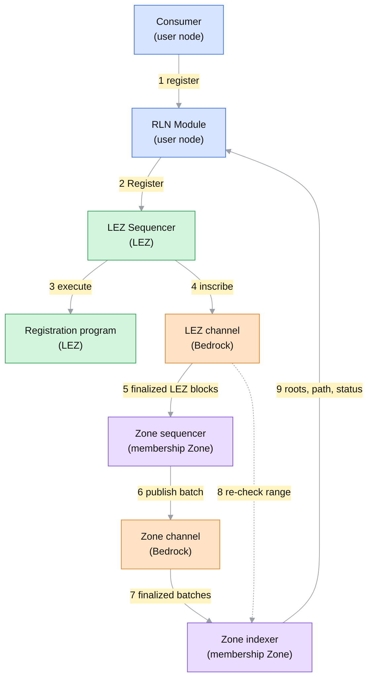
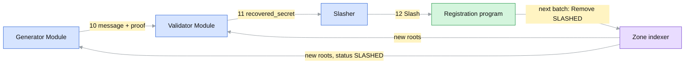
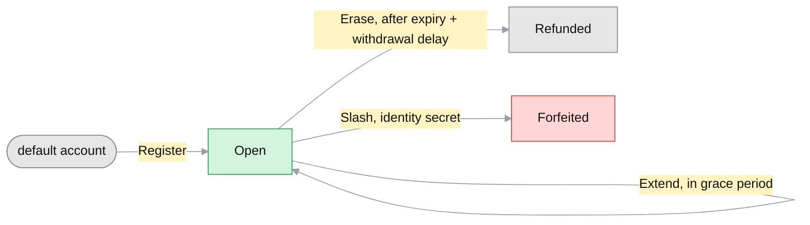
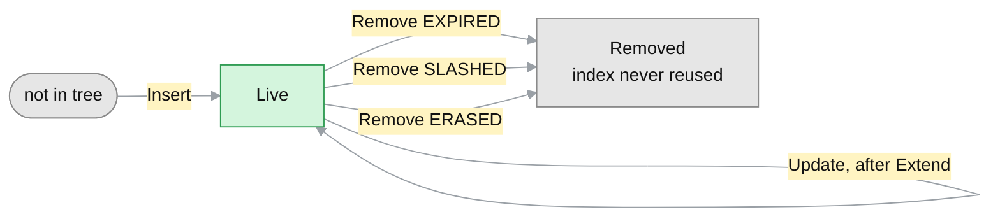
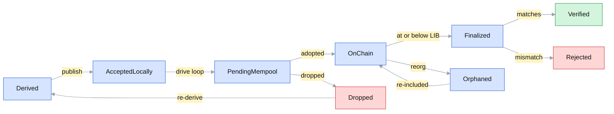
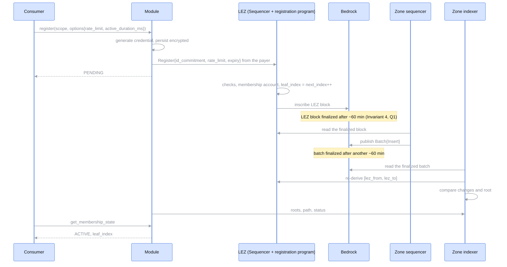
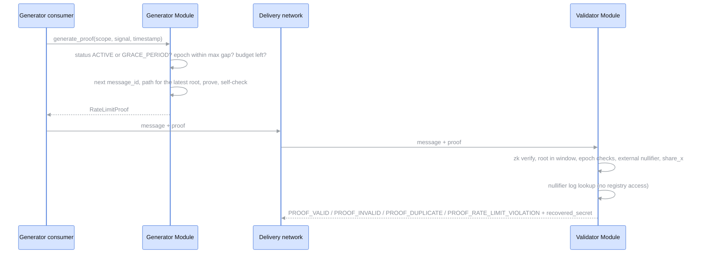
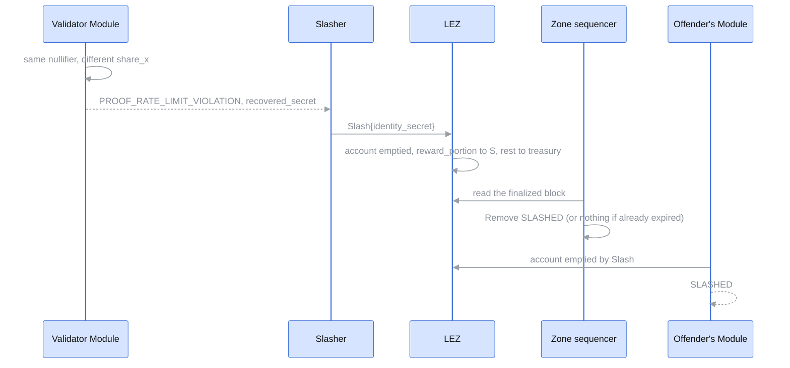

# RLN-MEMBERSHIP-ZONE

| Field | Value |
| --- | --- |
| Name | RLN Membership Zone |
| Slug | TBD |
| Status | raw |
| Category | Standards Track |
| Tags | rln, membership, registry, zone |
| Editor | Vinh Trinh <vinh@status.im> |
| Contributors | |

## Abstract

This document specifies the RLN Membership Zone:
a registry, in the sense of the
[RLN-API](https://lip.logos.co/anoncomms/raw/rln-api.html),
whose membership set is maintained by a dedicated Zone on the Logos Blockchain,
while deposits, refunds and slashing are anchored in a registration program
on the Logos Execution Zone (LEZ).

Registration is a single LEZ transaction that deposits for an identity commitment.
A Zone sequencer follows the registration program,
derives the corresponding changes to the membership set,
and publishes them in batches as inscriptions on Bedrock.
Bedrock totally orders and finalizes these inscriptions,
which makes the change log immutable and identical for every reader.
Because the log is immutable and the derivation is fixed and deterministic,
every honest Zone indexer that reads the same finalized batches and the same finalized LEZ blocks
computes the same membership set and the same roots.

Modules read roots, Merkle proof paths and membership state from a Zone indexer,
and use this registry through RLN-API unchanged,
under the existing `logos` namespace binding.
The Zone holds no funds and no general-purpose execution environment;
its economic security lives in the registration program.

## Motivation

The current `logos` registry, the
[logos-lez-rln](https://github.com/logos-co/logos-lez-rln) registration program
(lez-rln below),
keeps the membership set inside LEZ accounts.
Every registration recomputes the rate commitment and every level of the tree
inside the RISC Zero zkVM:

- one registration costs about 9.09M execution gas against `MAX_GAS_EXEC`,
  10M per transaction and per block, so a LEZ block holds at most one registration;
- at the floor execution base fee (`BASE_FEE_EXEC_MIN`, 8 atomic units per gas)
  its execution fee alone is about 72.7M atomic units;
- every registration exceeds the 5M `TARGET_GAS_EXEC`,
  so sustained registration raises the LEZ base fee for all LEZ users by about 10% per block;
- the tree is limited to depth 9 (512 leaves over its lifetime) to fit `MAX_GAS_EXEC`,
  which forces a non-standard depth-10 circuit on proof generators.

None of this cost is intrinsic to RLN.
A registry needs ordered, available, verifiable changes to its membership set,
which the Logos Blockchain provides to Zones directly,
while hashing can run natively.
Moving the membership set to a Zone removes the in-zkVM hashing,
lifts the size limit to the depth Zerokit ships (20),
and leaves LEZ with only the deposit logic.

## Semantic

The key words "MUST", "MUST NOT", "REQUIRED", "SHALL", "SHALL NOT",
"SHOULD", "SHOULD NOT", "RECOMMENDED", "MAY", and "OPTIONAL" in this document
are to be interpreted as described in [RFC 2119](https://www.ietf.org/rfc/rfc2119.txt).

## Terminology

Terms defined elsewhere keep the meaning and spelling of their source:

- [RLN-API](https://lip.logos.co/anoncomms/raw/rln-api.html):
  Module, Consumer, Application, Registry, `registry_id`, `rln_identifier`,
  Scope (`MembershipScope`), identity commitment, rate commitment,
  direct and delegated registration, epoch, valid-root window, confirmation window,
  `membership_hash`, the `MembershipStatus` and `ProofVerdict` values,
  and, from its `logos` namespace binding (Appendix A),
  registration program, configuration account and membership accounts.
- [32/RLN-V1](https://github.com/logos-co/logos-lips/blob/master/docs/anoncomms/draft/32/rln-v1.md):
  identity credential, identity secret.
  [RLN-V2](https://lip.logos.co/anoncomms/raw/rln-v2.html) calls `rate_limit` `user_message_limit`.
- [WAKU2-RLN-RELAY](https://lip.logos.co/messaging/core/draft/17/rln-relay.html):
  slasher, `reward_portion`, `acceptable_root_window_size`.
- [RLN Membership Allocation](https://lip.logos.co/anoncomms/raw/rln-membership-service.html):
  membership provider, client.
- [Logos glossary](https://docs.logos.co/get-started/glossary):
  Bedrock, Zone, channel, inscription, note, LEZ, program, PDA.
- [Mantle](https://lip.logos.co/blockchain/raw/bedrock-v1.1-mantle-specification.html):
  accredited keys, Zone sequencer, `CHANNEL_INSCRIBE`, `TRANSFER`, mandatory fee,
  `execution_gas_base_price`, `permanent_storage_gas_price`, `TokenValue`.
- [Cryptarchia](https://lip.logos.co/blockchain/raw/cryptarchia-v1-protocol.html):
  latest immutable block (LIB, `B_imm`), security parameter.
- [LEE v0.3](https://lip.logos.co/blockchain/raw/lez/lee-v0.3-specifications.html) and the LEZ code:
  account, `block_id`, clock accounts, top-level call, chained call, `ProgramEvent`,
  atomic units, LEZ Sequencer, LEZ Indexer, finalized.
- [Zone SDK](https://github.com/logos-blockchain/logos-blockchain/tree/0.3.0/zone-sdk):
  node wallet, drive loop, backfill, adopted, `TxStatus`.

"Epoch" is always the RLN epoch, never the Cryptarchia epoch.
This document adds:

| Term | Meaning |
| --- | --- |
| Batch | The payload of one `CHANNEL_INSCRIBE` in the Zone channel, carrying the membership-set changes of a contiguous range of LEZ blocks. |
| Zone indexer | Any party that replays the Zone channel, verifies every batch against LEZ and serves the registry view; distinct from the LEZ Indexer. |
| Zone lag | The distance between the latest finalized LEZ block and the `lez_to` of the latest finalized batch. |

## Open Questions

Points this draft has not settled, numbered in the order they were raised.
H blocks a sound deployment, M must be specified before implementation, L is polish.
Every other section marks the places a question touches with its number.

| # | Sev | Question | Current text | Proposal |
| --- | --- | --- | --- | --- |
| Q1 | H | Registration waits for two finalities: the LEZ block, then the batch. On testnet LIB is about 60 min, so `register` to `MEMBERSHIP_ACTIVE` takes about 2 h; lez-rln takes one LEZ block. The current Module's confirmation window is 300 s (`CONFIRMATION_WINDOW_SECS`), so it would report every registration `MEMBERSHIP_FAILED`. | Invariant 4 | Replace Invariant 4 by same-chain ordering: a batch MAY cover a LEZ block only if that block's inscription precedes the batch on the Bedrock chain. A reorg that drops the LEZ block then drops the later batch too, and batch finality implies coverage finality. Modules MAY act on adopted batches as a trust choice, giving `MEMBERSHIP_ACTIVE` within minutes. The confirmation window is sized per registry. |
| Q2 | H | One invalid batch halts every Zone indexer forever, so one bug or one compromised key ends the registry. | Zone Indexer Verification | An invalid batch is a no-op: Zone indexers keep the evidence and accept the next valid batch that continues from the last accepted `lez_to`. Censorship stays provable and becomes delay. |
| Q3 | H | Derivation reads "successful registration-program transactions"; a `Register` reached through a chained call instead of a top-level call (an allocation or gifter program) is ambiguous. | Derivation rules | Derive from registration-program events (`Registered{id_commitment, rate_limit, expiry_timestamp_ms, leaf_index}`, `Extended`, `Erased`, `Slashed`) in block order, emitted as `ProgramEvent`s with a `<program>::<Event>` selector as the bridge program does (`bridge::Deposit`). |
| Q4 | H | There is no cap on the total rate limit, so network load is unbounded; lez-rln has one (`can_register`). | Registration Program | `ConfigState.max_total_rate_limit` and `current_total_rate_limit`, checked by `Register`, decremented by `Erase` and `Slash`. |
| Q5 | H | Only the holder can `Erase`; an abandoned membership account keeps its deposit and its share of capacity forever. lez-rln's `Erase` is permissionless and refunds the recorded holder. | Registration Program | Make `Erase` permissionless as in lez-rln, still refunding `holder`, and require a public `holder`, since a refund to a private account id lands in public state where no key can spend it. |
| Q6 | M | The clock a Module uses for status is unspecified, and LEZ and the Zone can disagree for a while after any change. | Membership status | An asymmetric rule, since reading LEZ state costs no gas: a membership becomes usable only when both sides agree (membership account open, clock before `expiry_timestamp_ms`, leaf in an accepted root), and stops being usable as soon as either side says so (account emptied by `Slash` or `Erase`, clock at `expiry_timestamp_ms`, leaf removed). Report `MEMBERSHIP_SLASHED` as soon as LEZ shows the `Slash`, before the removal batch, although RLN-API describes `SLASHED` as "removed by slashing". The clock is the timestamp of the latest LEZ block in the Module's view. This protects honest Modules only (Q9). |
| Q7 | M | Outage longer than `withdrawal_delay_ms`. *Fail-open*: roots never age out, availability first, a holder who erased may keep proving with a stale root. *Fail-closed*: Modules drop any root whose `lez_to` is older than `withdrawal_delay_ms`, no proof is ever backed by withdrawn funds, a longer outage stops all proofs. A validator-side deny list is impossible since proofs hide the commitment. | Security 5 | Undecided. |
| Q8 | M | Empty batches are published every turn, which costs a fixed Mantle Transaction fee each time; nothing bounds how long a Zone sequencer may delay a change. | Cadence | Publish when there are changes; publish an empty batch only after `heartbeat_ms` without one (below `withdrawal_delay_ms` under fail-closed); SHOULD publish within `max_delay_ms` of the first unpublished change. |
| Q9 | M | A slashed or expired leaf keeps backing proofs for Zone lag plus the window length (Security 8). Validators cannot close this gap by reading LEZ, because a proof does not reveal which leaf produced it. A window counted only in roots never ages out while the tree is idle; lez-rln has the same hole (`ROOT_HISTORY_SIZE` = 4 previous roots). Invariant 6 does not count the time needed to detect a double-signal before `Erase`. | Invariant 6, Security 8 | Bound the window by time as well as by count (`max_root_age_ms`); size `acceptable_root_window_size`, `heartbeat_ms` and `withdrawal_delay_ms` against the removal lag, including detection delay; see Q17 for closing the gap at validators. |
| Q10 | M | No governance: who sets or changes `ConfigState`, controls `treasury_account_id` and `operator_account_id`, or moves `zone_channel_id` after a key loss. Membership accounts read the durations from the live config. | Registration Program | Snapshot `grace_period_duration_ms` and `withdrawal_delay_ms` into each membership account, as lez-rln snapshots its durations; either name an admin or make the config immutable and deploy a new registry on change. |
| Q11 | M | Zone sequencer state lives in memory; restart, a dropped batch and a round-robin hand-over are unspecified. | Operating a Zone sequencer | `lez_from` always comes from the last batch on the channel; a Zone sequencer indexes its own channel; keys rotate through `configuration_threshold`. |
| Q12 | M | The Zone indexer API is unspecified, so Modules and Zone indexers built by different teams cannot interoperate; asking a Zone indexer for a path by leaf index reveals the membership. | Registry View for Modules | Modules maintain the tree themselves from batches read on Bedrock (20 hashes per change, about 64 MB at 1M leaves) and use Zone indexers only for status; or specify a minimal API. |
| Q13 | M | Economics: `reg_fee` is fixed on LEZ while the Bedrock gas prices float; the bridge `Withdraw` from LEZ to Bedrock is disabled today; LEZ testnet state uses 10^9 atomic units per LGO while the Mantle and Storage Markets specs price gas in LGO with no sub-unit; exhausting 2^20 leaves costs only `2^20 * (reg_fee + LEZ fee)` since deposits come back; the slasher share is optional; `Extend` and removals cost bytes but pay nothing. | Incentivization | Price `reg_fee` against capacity and Bedrock cost in atomic units; add `reward_portion`; define what happens when the tree is full (a new registry, Modules register again). |
| Q14 | M | Anyone can `Register` a victim's commitment first: the victim's `Register` reverts while a membership account for the commitment exists with a foreign holder. | Membership status | The Module treats a membership account whose `holder` is not its payer as the absence of its own registration: after the confirmation window it reports `MEMBERSHIP_FAILED` (observed absent) and registers a fresh membership. |
| Q15 | M | A clock jump can expire so many leaves in one LEZ block that its changes alone exceed one inscription, and a batch cannot split a block. | Cadence | A per-block cap on expiry removals carrying the rest forward, or batches that continue a block. |
| Q16 | L | Smaller points: a reverted `Register` is visible at once but the Module waits the whole confirmation window, and RLN-API allows `MEMBERSHIP_FAILED` only after it; the `ERASED` cause is reachable only on a clock jump; under delegation the client can neither extend nor erase; lez-rln's `ForceExpire` (start the grace period now) has no counterpart. | various | Propose an RLN-API change allowing `MEMBERSHIP_FAILED` on an observed revert; keep `ERASED` with a note; document delegated holding; decide whether `ForceExpire` is needed. |
| Q17 | H | The membership set is a pure function of LEZ (Invariant 2), so a Module that follows LEZ could derive it without waiting for batches. Today every Module, validators included, waits for the batch before it sees a removal. | Registry View for Modules, Zone Batches | Validator-side derivation: a Module with a local tree (Q12) follows registration-program events on LEZ, applies a removal as soon as it sees it, and drops from its window every root older than that removal. Applying the same rules at the same LEZ `block_id`, all such Modules compute the same roots, so a slashed leaf stops validating within one LEZ block. Batches remain the attested roots for light Modules, the censorship evidence, and the common reference for root agreement. To discuss: the cost of following LEZ from the registry's first block; honest proofs on an evicted root are rejected and must be regenerated; whether insertions should also be derived this way (Q1); and how much of the Zone remains needed. |
| Q18 | M | Forfeited deposits accrue to `treasury_account_id`, an account nobody is named to hold and with no stated use (lez-rln does the same; LEE cannot burn, since credits must equal debits). Meanwhile the Zone's only running cost, the Mantle Transaction fees of its batches, is paid on Bedrock. | Registration Program, Incentivization | Use forfeited deposits to operate the Zone: `Slash` credits the remainder after `reward_portion` to `operator_account_id` (or the treasury is the operator account), and the operator periodically moves it through the bridge `Withdraw` to Bedrock to refill the Zone sequencers' node wallets, next to `reg_fee` (Phase 2). To discuss: slashing income is irregular, so it can only supplement `reg_fee`; the operator gains from every slash, which is harmless since a slash needs the identity secret but rewards an operator that also runs a validator; split between operators once several run Zone sequencers; blocked while the bridge `Withdraw` is disabled. |

## Format Specification

### Assumptions

- Bedrock totally orders and finalizes channel inscriptions and keeps them available.
- LEZ blocks are inscribed on Bedrock; a LEZ block is finalized once its inscription is.
- Each LEZ block carries a `timestamp` in Unix-epoch milliseconds,
  which the clock program writes to the clock accounts
  and which RLN-API's `logos` binding uses as its time base.
- Rate commitments are `poseidon(identity_commitment, rate_limit)` over BN254, as in RLN-API.
- The membership set is a Merkle tree of depth 20, append-only in leaf indices:
  a removed leaf is set to the empty value and its index is never reused,
  so the registry holds at most 2^20 memberships over its lifetime.
  The registration program assigns leaf indices and enforces that capacity.
- Only accredited keys write to the Zone channel
  ([Mantle channel operations](https://lip.logos.co/blockchain/raw/bedrock-v1.1-mantle-specification.html));
  anyone reads it.

## Components

| Component | Runs where | Holds | Talks to |
| --- | --- | --- | --- |
| Consumer | the user's node, e.g. a Logos Delivery node | nothing RLN-specific | the Module, through RLN-API |
| Module | inside the user's node | keystore, membership records, registry view (valid-root window, Merkle proof paths, statuses), nullifier log, message-id allocation, a payer account on LEZ | LEZ (sends `Register`, `Extend`, `Erase`; reads membership accounts), a Zone indexer or Bedrock (registry view) |
| Membership provider | third party | its own payer account on LEZ | clients' Modules (RLN Membership Allocation), LEZ (`Register` as holder) |
| LEZ Sequencer | the LEZ sequencer set | LEZ state and mempool | payers (transactions), Bedrock (inscribes LEZ blocks) |
| LEZ Indexer | anyone | finalized LEZ blocks, events and accounts | Zone sequencers, Zone indexers and Modules (reads) |
| Registration program | LEZ | configuration account, escrow, membership accounts | invoked by top-level and chained calls |
| Bedrock | Logos Blockchain nodes | channels, notes, LIB | everyone reads; accredited keys write their channel |
| Zone sequencer | the Zone operator, 2-3 accredited keys | its replica of the membership set, node wallet notes, the batch in flight | LEZ (reads), Bedrock (publishes batches); never receives input from Modules |
| Zone indexer | anyone; holds no accredited key | verified membership set, root history `(root_after, lez_to)` | Bedrock (reads batches), LEZ (re-checks ranges), Modules (serves the view) |
| Slasher | anyone, typically a validator's operator | a payer account on LEZ | its Module (`recovered_secret`), LEZ (`Slash`) |

LEZ never reads the Zone and the Zone never writes to LEZ.
Reading LEZ costs no gas, so the registry adds no LEZ load beyond the registrations themselves.

## Flow

Arrows show where data goes and numbers give the order.
Blue is a user's node, green LEZ, orange Bedrock, purple the membership Zone.

### Registration (steps 1-9)



### Messaging and slashing (steps 10-12)



| Step | From | To | What moves | When |
| --- | --- | --- | --- | --- |
| 1 | Consumer | Module | `register(scope, options)` with `rate_limit` and `active_duration_ms` | once per membership |
| 2 | Module | LEZ Sequencer | `Register` (later `Extend`, `Erase`) | registration, renewal, withdrawal |
| 3 | LEZ Sequencer | registration program | membership account, `leaf_index`, deposit, `reg_fee` | same LEZ block |
| 4 | LEZ Sequencer | LEZ channel | the LEZ block as an inscription | every LEZ block |
| 5 | LEZ channel | Zone sequencer | registration-program changes of finalized LEZ blocks | after LEZ finality (Q1) |
| 6 | Zone sequencer | Zone channel | `Batch{lez_from, lez_to, changes, root_after}` | see Cadence |
| 7 | Zone channel | Zone indexer | finalized batches | after batch finality (Q1) |
| 8 | LEZ | Zone indexer | the same LEZ range, re-derived and compared | per batch |
| 9 | Zone indexer | Modules | new roots, Merkle proof path, membership status | continuously, off the hot path (Q12) |
| 10 | generator Module | validator Module | message with its RLN proof | every message |
| 11 | validator Module | slasher | identity secret revealed by double-signalling | on a violation |
| 12 | slasher | LEZ | `Slash{identity_secret}`; the loop restarts at step 3 | on a violation |

## Registry Identification

This registry uses the `logos` namespace binding of RLN-API (Appendix A) with the same fields;
the differences from lez-rln are noted inline:

- **Namespace**: `logos`.
- **Reference**: the network name, lowercase.
- **Anchor account**: the registration program's configuration account (`ConfigState`),
  from which every other object of the registry is derived.
  Unlike lez-rln, those objects are the escrow, the membership accounts,
  the treasury, the operator account and the Zone channel id, not tree accounts:
  the membership set lives in the Zone.
- **Canonical `account_address` form**: 64 lowercase hexadecimal characters, without prefix.
- **`RegistryOptions`**: `funding_holding_account_id`,
  the payer account paying `rate_limit × price_per_unit` as in Appendix A,
  plus `reg_fee` (see Incentivization), in the LEZ native token;
  the common key `rate_limit` as defined by RLN-API;
  and the registry-specific key `active_duration_ms`,
  the requested active duration as a decimal string,
  defaulting to `max_active_duration_ms` when absent.
- **Time base**: the LEZ clock accounts, in Unix-epoch milliseconds;
  the active duration, the grace period and the withdrawal delay use the same unit.

As in RLN-API, a Module treats `registry_id` as opaque;
how it accesses a registry comes from its configuration (`start()`).
For this registry that configuration names LEZ access
and one or more Zone indexer endpoints.
`membership_hash` is computed as in RLN-API Appendix B,
and a membership backs every application whose scope names this `registry_id`.

## Registration Program

### State

```rust
/// Configuration account, the anchor of the registry.
struct ConfigState {
    zone_channel_id: [u8; 32],
    min_rate_limit: u64,
    max_rate_limit: u64,
    /// Atomic units of deposit per unit of `rate_limit`.
    price_per_unit: u128,
    /// Non-refundable, per `Register`, credited to `operator_account_id`.
    reg_fee: u128,
    min_active_duration_ms: u64,
    max_active_duration_ms: u64,
    /// Length of the grace period before `expiry_timestamp_ms`.
    grace_period_duration_ms: u64,
    /// Delay after `expiry_timestamp_ms` before `Erase` may refund the deposit.
    withdrawal_delay_ms: u64,
    /// Receives forfeited deposits.
    treasury_account_id: [u8; 32],
    /// Receives `reg_fee`.
    operator_account_id: [u8; 32],
    /// Declared epoch size (advisory, RLN-API).
    epoch_size_sec: u64,
    /// Next free leaf index, advanced by every `Register`.
    next_index: u64,
}

/// Membership account, a PDA with seeds `["membership", id_commitment]`.
struct MembershipState {
    /// Assigned by `Register`, never changes.
    leaf_index: u64,
    rate_limit: u64,
    /// Little-endian.
    id_commitment: [u8; 32],
    /// Unix-epoch milliseconds.
    expiry_timestamp_ms: u64,
    /// The account `Erase` refunds the deposit to.
    holder: [u8; 32],
    /// `rate_limit * price_per_unit`, held in the escrow.
    deposit_amount: u128,
}
```

Both accounts are borsh-encoded, as in lez-rln.
Who may change `ConfigState` is not specified (Q10); there is no total rate cap (Q4).

### Membership account lifecycle



`Erase` and `Slash` empty the membership account.
A LEZ account never returns to its default state,
so an identity commitment registers at most once, as in lez-rln.

### Instructions, checks in order

`now` is the `timestamp` of the clock account `CLOCK_01`.
The clock program writes it as the last transaction of every block,
so a transaction sees the timestamp of the previous block;
lez-rln reads `CLOCK_50`, which can lag by up to 49 blocks.

`Register{id_commitment, rate_limit, expiry_timestamp_ms}`, signed by the payer:

- **Bounds.** `min_rate_limit <= rate_limit <= max_rate_limit`
  and `min_active_duration_ms <= expiry_timestamp_ms - now <= max_active_duration_ms`.
  Fail and revert.
- **Uniqueness.** The membership account for `id_commitment` is a default account. Fail and revert.
- **Capacity.** `next_index < 2^20`. Fail and revert, as lez-rln does
  when every leaf index has been used.
- **Payment.** Move `deposit_amount` to the escrow and `reg_fee` to `operator_account_id`.
- **Accept.** Fill the membership account with `holder` set to the payer
  and `leaf_index = next_index`, then increment `next_index`.

`Extend{id_commitment, expiry_timestamp_ms}`, signed by `holder`:

- **Grace period.** `expiry - grace_period_duration_ms <= now < expiry`
  for the stored expiry, as lez-rln allows renewal only in the grace period.
  An expired membership cannot be extended; its holder erases it and registers again.
  Fail and revert.
- **Monotone.** The new `expiry_timestamp_ms` is greater than the stored one
  and within `max_active_duration_ms` of `now`.
  Fail and revert.
- **Accept.** Store `expiry_timestamp_ms`.

lez-rln's `Extend` takes no expiry and adds the stored durations instead.

`Erase{id_commitment}`, signed by `holder`:

- **Withdrawal delay.** `now >= expiry_timestamp_ms + withdrawal_delay_ms`. Fail and revert.
- **Accept.** Refund `deposit_amount` to `holder` and empty the membership account.
  Nobody else can erase an abandoned membership (Q5).

`Slash{identity_secret}`, signed by anyone:

- **Membership.** The membership account for `id_commitment = poseidon(identity_secret)`
  is open. Fail and revert.
- **Accept.** Move `deposit_amount` to `treasury_account_id`,
  optionally a `reward_portion` to the signer (Q13),
  and empty the membership account.

The registration program stores and hashes no tree; its only Poseidon evaluation is in `Slash`.

## Zone Batches

### Batch format

```protobuf
syntax = "proto3";

message Batch {
  uint64 lez_from   = 1;   // first LEZ block_id covered, inclusive
  uint64 lez_to     = 2;   // last LEZ block_id covered, inclusive
  repeated Change changes = 3;   // in LEZ order
  bytes  root_after = 4;   // 32 bytes, little-endian, membership-set root after the changes
}

message Change {
  oneof kind {
    Insert insert = 1;
    Update update = 2;
    Remove remove = 3;
  }
}
message Insert { bytes id_commitment = 1; uint64 rate_limit = 2; uint64 expiry_timestamp_ms = 3; }
message Update { uint64 leaf_index = 1; uint64 expiry_timestamp_ms = 2; }
message Remove { uint64 leaf_index = 1; Cause cause = 2; }
enum Cause { EXPIRED = 0; SLASHED = 1; ERASED = 2; }
```

One batch per `CHANNEL_INSCRIBE`; the Zone SDK calls such a message a `ZoneBlock`.

### Derivation rules

For every finalized LEZ block in `[lez_from, lez_to]`, in order,
and every successful registration-program transaction in that block, in order (Q3):

- `Register` produces `Insert`; the rate commitment is placed at the membership account's `leaf_index`.
  Leaf indices therefore follow `Register` order and the Zone never assigns one itself.
- `Extend` produces `Update` for the membership's leaf,
  which is always present because `Extend` requires `now < expiry_timestamp_ms`.
  The root does not change.
- `Slash` and `Erase` produce `Remove` with the matching cause, if the leaf is still present.
  A `Slash` after the leaf expired produces no change,
  but the membership is still reported as slashed (see Membership status).
  `Erase` finds the leaf present only when the clock jumps over the whole withdrawal delay (Q16).

After the transactions of a block, every leaf whose `expiry_timestamp_ms` is at or below
that block's `timestamp` produces `Remove{cause: EXPIRED}`,
in increasing leaf index.
A leaf expires at most once, so a later block with a smaller `timestamp` has no effect.



### Cadence

A Zone sequencer SHOULD publish one batch per `turn_to_write` of the Zone channel,
covering every finalized LEZ block not yet covered.
When those changes would not fit in one inscription
(at most 1,835,008 bytes, the node's `inscribe::MAX_BYTES`, 7/8 of the 2 MiB block),
the batch MAY end at an earlier LEZ block boundary;
the next batch continues from there.
A batch always covers whole LEZ blocks (Q15).
A batch without changes is valid; it advances `lez_to` and keeps root age measurable (Q8).

### Operating a Zone sequencer

A batch moves through the Zone SDK `TxStatus` values, framed by two states of its own;
a Zone indexer only ever sees `Finalized` ones.



Derived, Verified and Rejected are this document's;
the SDK does not track a transaction dropped from the mempool.
These notes come from running the reference demo against a Logos Blockchain node with the Zone SDK:

- **Fee notes.** Each batch is one Mantle Transaction whose fee the node wallet pays
  with a whole note. The wallet reserves that note until the transaction is observed in a block,
  so a wallet holding `n` spendable notes can have at most `n` batches in flight.
  A Zone sequencer SHOULD either keep at most one batch in flight,
  letting the next batch cover every LEZ block finalized meanwhile,
  or keep its node wallet split into enough notes for its target number of in-flight batches.
- **Publish is not posting.** A successful SDK `publish` funds and queues the transaction
  (`AcceptedLocally`); it reaches the node only when the Zone sequencer's drive loop runs.
  A Zone sequencer MUST keep driving the SDK between publishes, and MUST NOT fire publishes
  in a burst (for example after a long backfill of a fresh channel).
- **Landing signal.** Blocks the SDK ingests through its backfill path report no channel update,
  so a batch may never be reported as adopted.
  The appearance of the batch's message among finalized inscriptions is the reliable signal
  that it landed.
- **Recovery.** A dropped batch, a restart or a hand-over between Zone sequencers
  is not specified yet (Q11).

## Zone Indexer Verification

### Invariants

A Zone indexer MUST reject a batch, and every later batch, that violates any of these (Q2):

1. **No funds.** The Zone holds no funds and keeps no ledger; all value moves on LEZ.
2. **Pure derivation.** The membership set is a pure function of the ordered
   registration-program transactions in finalized LEZ blocks.
3. **Completeness.** Batch `k` covers exactly `[lez_to(k-1) + 1, lez_to(k)]`,
   with no gap and no overlap,
   and contains exactly the changes implied by the derivation rules.
   An omission is provable censorship.
4. **Finality.** Only finalized LEZ blocks are covered, so LEZ reorgs never reach the Zone (Q1).
5. **Root.** `root_after` equals the root obtained by applying the batch.
6. **Withdrawal delay.** `withdrawal_delay_ms` is at least the maximum tolerated Zone lag plus the time
   a root stays in the valid-root window, so a rate commitment is never usable
   after its deposit has left the escrow (Q9).
7. **Uniqueness.** At most one live leaf per identity commitment.

### Offchain calculations for Zone indexers

For each finalized batch, a Zone indexer:

- fetches the registration-program transactions and `timestamp` of every LEZ block
  in `[lez_from, lez_to]`, from a LEZ Indexer or its own LEZ node;
- derives the expected changes and compares them with `changes`;
- applies them and compares the root with `root_after`;
- on success, appends `(root_after, lez_to)` to its root history
  and updates the registry view it serves.

## Registry View for Modules

A Zone indexer serves what an RLN-API Module needs to maintain its local registry view:
new roots, the Merkle proof path of a membership,
the membership's `leaf_index`, `rate_limit` and status,
and the registry parameters from `ConfigState` (Q12).
As RLN-API requires, a Module maintains this view asynchronously
and never contacts a Zone indexer on the `validate_proof` path;
until its view is warm it answers `RLN_ERR_NOT_READY`.

### Membership status

Each row is one combination of membership account, leaf and clock;
the clock is the timestamp of the latest LEZ block in the Module's view (Q6),
and the grace period is `[expiry - grace_period_duration_ms, expiry)`.

| # | Membership account | Leaf in the Module's view | Clock | `MembershipStatus` | `generate_proof` |
| --- | --- | --- | --- | --- | --- |
| S1 | default, no local record | none | | `MEMBERSHIP_UNKNOWN` | no |
| S2 | default, `Register` submitted | none | | `MEMBERSHIP_PENDING` | no |
| S3 | open | not yet inserted (Zone lag) | | `MEMBERSHIP_PENDING` | no |
| S4 | default after the confirmation window, read succeeded | none | | `MEMBERSHIP_FAILED` | no |
| S5 | open | live | before the grace period | `MEMBERSHIP_ACTIVE` | yes |
| S6 | open | live | in the grace period | `MEMBERSHIP_GRACE_PERIOD` | yes; `Extend` allowed |
| S7 | open | live, removal not yet finalized | at or after expiry | `MEMBERSHIP_EXPIRED` | no |
| S8 | open | removed, `EXPIRED` | before expiry + withdrawal delay | `MEMBERSHIP_EXPIRED` | no; `Erase` reverts |
| S9 | open | removed, `EXPIRED` | at or after expiry + withdrawal delay | `MEMBERSHIP_ERASED_AWAITS_WITHDRAWAL` | no; `Erase` allowed |
| S10 | emptied by `Erase` | removed | | `MEMBERSHIP_ERASED` | no |
| S11 | emptied by `Slash` | live (lag) or removed | | `MEMBERSHIP_SLASHED` | no |
| S12 | open, `holder` is not the Module's payer | any | | not covered today (Q14) | |

`leaf_index` is known from the membership account as soon as `Register` is finalized
and never changes, so it is already fixed while `MEMBERSHIP_PENDING`;
the rate commitment becomes usable for proofs with the batch that inserts the leaf.
An open membership account without a leaf yet means the registry received the registration
and has not applied it: the membership stays `MEMBERSHIP_PENDING`, never `MEMBERSHIP_FAILED`.
As RLN-API requires, an unreachable LEZ or Zone indexer is not an observation of absence.
The confirmation window SHOULD cover the expected Zone lag on top of LEZ finality (Q1).
When expiry and `Erase` land in the same batch, a Module moves from S7 straight to S10.

### Direct registration

A Module registering directly sends `Register` from its `funding_holding_account_id`
with the requested `rate_limit` and `expiry_timestamp_ms = now + active_duration_ms`.
A `rate_limit` or `active_duration_ms` outside the bounds in `ConfigState` fails as `RLN_ERR_PERMANENT`.
`register` returns once `Register` is submitted and persisted, with the membership `MEMBERSHIP_PENDING`.

### Delegated registration

Under the [RLN Membership Allocation](https://lip.logos.co/anoncomms/raw/rln-membership-service.html)
protocol the membership provider sends `Register` for the client's identity commitment
and becomes `holder`, so only the provider can `Extend` or `Erase` (Q16).
Its `MembershipAllocationSuccess` can carry `block_number`, `transaction_hash`
and `leaf_index` at `Register` time,
while `merkle_root` exists only once a finalized batch contains the `Insert`;
`block_number` is then the LEZ `block_id` of the `Register`,
not the block that confirms the membership.
The provider SHOULD either wait for that batch before responding,
or respond at `Register` time and let the client's Module observe
the transition from `MEMBERSHIP_PENDING` to `MEMBERSHIP_ACTIVE` through a Zone indexer.

### Optional extensions

The registry supports these RLN-API optional extensions:

- **Withdrawal**: `Erase`, resolving `MEMBERSHIP_ERASED_AWAITS_WITHDRAWAL`.
- **Registry parameters read**: `ConfigState` (the accepted rate-limit range, durations, and the
  declared `epoch_size_sec`, which a Module SHOULD check against its configured epoch size).
- **Membership state subscriptions**: a Zone indexer MAY push status changes as batches finalize.

## Interaction Sequences

### Registration sequence



### Generating and validating a proof



### Expiry and withdrawal

1. The clock reaches `expiry - grace_period_duration_ms`: `MEMBERSHIP_GRACE_PERIOD`;
   the holder may `Extend`, which the next batch records as `Update`.
2. The clock reaches the expiry: `MEMBERSHIP_EXPIRED`, the Module stops generating proofs (S7).
3. The batch covering the first LEZ block with `timestamp` at or after the expiry
   carries `Remove EXPIRED`; once finalized: still `MEMBERSHIP_EXPIRED` (S8).
4. Old roots that still contain the leaf age out of the window (Invariant 6).
5. At `expiry + withdrawal_delay_ms`: `MEMBERSHIP_ERASED_AWAITS_WITHDRAWAL` (S9);
   the holder sends `Erase`: deposit refunded, `MEMBERSHIP_ERASED`.

### Double-signalling and slashing



Between `Slash` and the removal batch, plus the window length,
the offender's leaf still backs valid proofs (Q9).

### Module start

1. `start()`: load keystore and records, connect LEZ and a Zone indexer (or Bedrock).
2. Warm the view: root window, paths, statuses; until warm every call returns `RLN_ERR_NOT_READY`.
3. Re-check every `MEMBERSHIP_PENDING` record against LEZ and the view.

## Incentivization

The membership Zone has no execution environment of its own,
so it custodies no stake and runs no slashing logic.
All economic security lives in the registration program.

### Who pays what

- **Payers** (a Module's `funding_holding_account_id`, or a membership provider) pay
  the deposit and `reg_fee` in `Register`, plus the LEZ fee of their own transactions.
  The deposit is refundable; `reg_fee` is not.
- **The Zone operator** pays the Mantle Transaction fees of every batch from its node wallet.
  Only accredited keys inscribe to the Zone channel, so payers cannot pay them directly.
- **Zone indexers** pay nothing on chain; reading Bedrock and LEZ is free.

### Revenue and reimbursement

The mandatory fee of a Mantle Transaction is
`tx_execution_gas * execution_gas_base_price + len(encode(signed_tx)) * permanent_storage_gas_price`,
both prices with a floor of 1
([Execution Market](https://lip.logos.co/blockchain/raw/execution-market.html),
[Storage Markets](https://lip.logos.co/blockchain/raw/storage-markets.html)).
A batch is one `CHANNEL_INSCRIBE` plus one `TRANSFER` paying the fee from a node wallet note,
so a batch carrying `N` insertions costs about
`(59 + 590) * execution_gas_base_price + (632 + 45 * N) * permanent_storage_gas_price`:
`EXECUTION_CHANNEL_INSCRIBE_GAS` is 59 in Mantle v1.16.0 (56 in node 0.3.0),
`EXECUTION_TRANSFER_GAS` is 590,
and the byte counts, about 45 per insertion, are measured with the reference demo.
At floor prices and `N = 100` this is about 58 atomic units per membership,
against about 72.7M on lez-rln.
LEZ and Bedrock amounts are the same token at 1:1 in atomic units
(`TokenValue`, `u64`, on Bedrock; `u128` on LEZ),
so `reg_fee` compares directly with this cost (Q13).

- **Phase 1.** The operator funds its node wallet directly.
- **Phase 2.** `reg_fee` accrues to `operator_account_id` on LEZ and is periodically withdrawn
  through the bridge program to Bedrock to refill the node wallet,
  so registration is fee-backed by the payers who consume it,
  in the spirit of the [Logos Oracle Zone](https://lip.logos.co/anoncomms/raw/logos-oracle-zone.html).
  The bridge `Withdraw` is disabled in the current LEZ release.
  Forfeited deposits could refill the node wallets the same way (Q18).

### Slashing

Slashing fires on one strict, provable condition:
knowledge of the identity secret, which only double-signalling reveals
and which a Module's `validate_proof` reports as `recovered_secret`.
The proof is the secret itself, checked by one Poseidon evaluation in the registration program,
so false positives are impossible.
The deposit goes to `treasury_account_id`; a `reward_portion` MAY go to the slasher,
funding a permissionless watchdog economy (Q13).
What the treasury is for is open (Q10, Q18).

## Time and Windows

- **Time base.** LEZ block `timestamp`s in Unix-epoch milliseconds, as in the `logos` binding.
  The Zone uses the `timestamp` of each LEZ block, which keeps derivation deterministic.
- **Finality.** The Bedrock testnet deployment sets `security_param` (Cryptarchia's
  security parameter `k`, protocol default 2160 blocks) to 120,
  with about one block per 30 s, so LIB trails the tip by about 60 minutes (Q1).
- **Epoch.** As in RLN-API, `epoch_index = timestamp / epoch_size`;
  the registry does not change epoch semantics.
- **Valid-root window.** As in RLN-API, the window, its length and the maximum epoch gap
  are Module configuration per registry, not enforced by the registry,
  and proof generators and validators MUST use the same values.
  This registry produces at most one new root per batch (a batch without changes adds none),
  tags each root with the `lez_to` of its batch,
  and RECOMMENDS a window length `acceptable_root_window_size`.
- **Withdrawal delay.** `withdrawal_delay_ms`, bounded below by Invariant 6.

## Parameters

| Parameter | Symbol | Default | Notes |
| --- | --- | --- | --- |
| Tree depth | | 20 | Matches the circuits Zerokit ships; 2^20 lifetime memberships, enforced by `Register`. |
| Rate-limit bounds | `min_rate_limit`, `max_rate_limit` | 100, 600 | As lez-rln's `MIN_RATE_LIMIT` and `MAX_RATE_LIMIT`. |
| Deposit per rate unit | `price_per_unit` | TBD | Economic cost of a membership. |
| Registration fee | `reg_fee` | TBD | Covers the operator's Bedrock cost with margin (Q13). |
| Active duration | `min_active_duration_ms`, `max_active_duration_ms` | TBD | |
| Grace period | `grace_period_duration_ms` | TBD | Drives `MEMBERSHIP_GRACE_PERIOD` and the `Extend` window. |
| Withdrawal delay | `withdrawal_delay_ms` | TBD | From measured Zone lag and `acceptable_root_window_size` (Q9). |
| Valid-root window length (Module configuration) | `acceptable_root_window_size` | TBD | Sized against `epoch_size`. |
| Maximum epoch gap (Module configuration) | `max_epoch_gap` | 1 | As the current Module. |
| Batch cadence | | one per `turn_to_write` | Empty batches allowed (Q8). |
| Zone sequencers | `accredited_keys` | 2-3 operator keys | Round-robin with `posting_timeout` for failover. |
| Hash | | Poseidon (BN254) | Poseidon2 once Zerokit 3.1.0 and matching circuits are deployed. |

## Security Considerations

1. **Censorship and delay.** A dishonest Zone sequencer can delay or omit memberships
   but cannot add one without a matching `Register`,
   since every Zone indexer re-derives the changes from LEZ (Invariant 3).
   Omission is provable from public data; delay is not bounded yet (Q8).

2. **Registry trust.** RLN-API states that a Module trusts its registry access.
   For this registry a Module chooses its level:
   (i) run a Zone indexer, verifying everything by replay;
   (ii) read batch roots from the Zone channel through a Logos Blockchain node,
   trusting only that an accredited key signed them, with Zone indexers auditing Invariant 5;
   (iii) query one Zone indexer, the trust current Modules place in a LEZ RPC provider.
   LEZ public state is itself verified by re-execution rather than proofs,
   so moving the membership set to a Zone does not weaken the trust model.
   As RLN-API notes, reading through a third party MAY link a Consumer's network identity
   to its membership (Q12).

3. **Funds.** Only the registration program moves funds; no Zone component can,
   and slashing does not depend on the Zone.

4. **Zone sequencer failure.** An outage stops new insertions and removals;
   it loses no data and no funds, and existing memberships keep backing proofs.
   State is reconstructible from Bedrock at any time.
   Losing the accredited keys is the real risk:
   several keys on separate hosts with round-robin failover mitigate it,
   and as a last resort the registry can restart on a new channel from the replayed state (Q10, Q11).

5. **Long outage.** An outage longer than `withdrawal_delay_ms` forces a choice
   between availability and never backing a proof with withdrawn funds (Q7).

6. **Clock.** The LEZ `timestamp` is set by the LEZ Sequencer and is not guaranteed monotonic.
   Expiry is applied at most once per leaf, so a clock moving backwards cannot revive a membership;
   a clock moving forwards can shorten a membership and its withdrawal delay,
   the same exposure as lez-rln, and can make one block oversized (Q15).

7. **LEZ dependency.** The registry inherits LEZ liveness for new registrations
   and LEZ finality for safety (Invariant 4).

8. **Removal lag.** A removed leaf keeps backing proofs until its last root leaves the window.
   After Mallory double-signals and a slasher sends `Slash`,
   an honest Module reading LEZ would stop at once (Q6),
   but Mallory runs a modified client.
   Validators see only the root, the nullifier and the shares, not the leaf,
   so they keep accepting Mallory's proofs against the old root
   until the removal batch lands and that root leaves the window.
   Since the secret is now public, anyone can use that membership meanwhile.
   The nullifier still caps it at `rate_limit` messages per epoch,
   but nothing is left to slash (Q9, Q17).

9. **Capacity.** The tree holds 2^20 lifetime memberships and the total rate is not capped,
   so both can be exhausted by payers who get their deposits back (Q4, Q13).

## Future Work

- A validity proof per batch, or an optimistic dispute window in the style of the
  Logos Oracle Zone, so light clients verify roots without replay.
- Pushing roots to LEZ, only if a LEZ program needs to verify RLN proofs on chain.
- A Zone sequencer committee run by independent operators.
- Poseidon2 for the membership set once Modules support it.
- Withdrawal of `reg_fee` and forfeited deposits from LEZ to Bedrock, pending the bridge `Withdraw` (Q18).

## Appendix A: Case Catalogue

Every case we can enumerate, with where this document covers it.
"demo" and "unit test" refer to the reference demo in this repository.

### Registration cases

| ID | Case | Outcome | Covered |
| --- | --- | --- | --- |
| R1 | Direct, happy path | `MEMBERSHIP_ACTIVE` | Registration sequence, demo |
| R2 | Delegated | membership provider is holder | Delegated registration |
| R3 | `rate_limit` or active duration out of bounds | `Register` reverts, `RLN_ERR_PERMANENT`; a Module can pre-check with the registry parameters read | Register checks, demo |
| R4 | Tree full | `Register` reverts, `RLN_ERR_PERMANENT` | Register Capacity, unit test |
| R5 | Insufficient balance | revert; transient or permanent per Module policy | demo |
| R6 | `Register` dropped, never included | S2 until the window, then S4 on a successful read | Membership status |
| R7 | LEZ or Zone indexer unreachable | stays `MEMBERSHIP_PENDING` | Membership status |
| R8 | Membership account open, Zone lagging | S3, never `MEMBERSHIP_FAILED` | Membership status |
| R9 | `register` again while live | same membership | RLN-API |
| R10 | `register` after a terminal state | fresh membership; old deposit still claimable | RLN-API |
| R11 | Someone registers the victim's commitment first | membership with a foreign holder | Q14 |
| R12 | `Register` and `Slash` in one batch range | `Insert` then `Remove SLASHED` | Derivation rules |
| R13 | `Register` through a chained call | ambiguous | Q3 |

### Lifecycle cases

| ID | Case | Outcome | Covered |
| --- | --- | --- | --- |
| L1 | `Extend` in the grace period | `Update` | Extend checks, unit test |
| L2 | `Extend` outside the grace period | revert | Extend checks, unit test |
| L3 | Expiry passed, removal not yet finalized | `MEMBERSHIP_EXPIRED`, Module stops proofs | Membership status |
| L4 | `Erase` too early | revert | Erase checks |
| L5 | Expiry and `Erase` in one batch | S7 straight to S10 | Membership status, demo |
| L6 | Holder never erases | deposit and capacity stuck | Q5 |
| L7 | Many leaves expire in one block | `Remove` in leaf order | Derivation rules, unit test |
| L8 | One block's changes exceed one inscription | open | Q15 |
| L9 | Parameters change while membership accounts are open | open accounts follow the new durations | Q10 |

### Proof cases

| ID | Case | Outcome | Covered |
| --- | --- | --- | --- |
| P1 | Generate in S5 or S6 | proof | RLN-API |
| P2 | Budget spent | `RLN_ERR_BUDGET_EXHAUSTED` | RLN-API |
| P3 | Timestamp outside the maximum epoch gap | `RLN_ERR_PERMANENT` | RLN-API |
| P4 | Generator uses a root the validator has not seen yet | false `PROOF_INVALID` | Valid-root window, Q12 |
| P5 | Long-parked message, root evicted | `PROOF_INVALID`; proof staleness check | RLN-API |
| P6 | Retransmission | `PROOF_DUPLICATE` | RLN-API |
| P7 | Double-signal | `PROOF_RATE_LIMIT_VIOLATION` | Interaction Sequences |
| P8 | Removed leaf, old root still in window | proof still valid | Security 8, Q9, Q17 |
| P9 | Validator without membership | validates from the view alone | RLN-API |
| P10 | View not warm | `RLN_ERR_NOT_READY` | Registry View for Modules |
| P11 | Epoch or window configuration differs across nodes | proofs rejected elsewhere | RLN-API |

### Slashing cases

| ID | Case | Outcome | Covered |
| --- | --- | --- | --- |
| K1 | Slash a live membership | `Remove SLASHED` | Derivation rules, demo |
| K2 | Slash during the withdrawal delay | no change, S11 | Derivation rules, unit test |
| K3 | Slash after `Erase` | revert, nothing to forfeit | Q9 |
| K4 | Several slashers race | first wins, the rest revert and may still pay LEZ fees | Q13 |
| K5 | LEZ Sequencer copies the `Slash` | `reward_portion` moves, safety unaffected | Q13 |
| K6 | Offender keeps proving after the slash | until removal plus window; anyone can, the secret is public | Security 8, Q9, Q17 |

### Zone operation cases

| ID | Case | Outcome | Covered |
| --- | --- | --- | --- |
| Z1 | Normal batch | Cadence | demo |
| Z2 | No changes | empty batch every turn | Cadence, Q8 |
| Z3 | Batch too large | ends at an earlier block | Cadence, demo |
| Z4 | Node wallet out of notes or funds | one batch in flight; outage when empty | Operating a Zone sequencer |
| Z5 | Batch dropped from the mempool | re-derive | Q11 |
| Z6 | Zone sequencer restart | resume from the last batch on the channel | Q11 |
| Z7 | Round-robin hand-over | next key continues the range | Q11 |
| Z8 | Bedrock reorg above LIB | batch `Orphaned`; Zone indexers read finalized only | Invariant 4 |
| Z9 | LEZ reorg | only finalized LEZ blocks covered | Invariant 4, Q1 |
| Z10 | Outage longer than `withdrawal_delay_ms` | fail-open or fail-closed | Q7 |
| Z11 | Key loss or compromise | new channel, `zone_channel_id` must change | Q10, Q11 |
| Z12 | Mantle Transaction fees above `max_tx_fee` | batches stall | Operating a Zone sequencer (not covered) |

### Adversarial cases

| ID | Case | Outcome | Covered |
| --- | --- | --- | --- |
| A1 | Zone sequencer omits a change | Zone indexer rejects | Invariant 3, demo `--censor` |
| A2 | `Insert` without `Register` | rejected | Invariant 3 |
| A3 | Wrong `root_after` | rejected | Invariant 5 |
| A4 | Range gap or overlap | rejected | Invariant 3 |
| A5 | Zone sequencer delays | allowed, lag is public | Q8 |
| A6 | Garbage from a compromised key | every Zone indexer halts | Q2 |
| A7 | Zone indexer lies to a Module | trusted at level (iii) | Security 2, Q12 |
| A8 | Exhaust the tree | registry full after 2^20 `Register`s | Q13 |
| A9 | Fill the network's rate capacity | no cap | Q4 |
| A10 | LEZ Sequencer moves the clock | shortens memberships and the withdrawal delay | Security 6 |

## Appendix B: Open for Implementation

What only an implementation will tell:

- Real LEZ gas of `Register`, `Extend`, `Erase` and `Slash`;
  `Slash` carries one Poseidon evaluation, about 0.9M cycles in the lez-rln guest.
- Whether the LEZ Indexer's event filter (by program and selector)
  serves registration-program events cheaply enough for Zone indexers (Q3).
- How the Zone reads "LEZ inscriptions before this batch" in practice (Q1).
- Zone SDK behaviour when a transaction is dropped or the node restarts (Q11).
- Mantle Transaction fees under load and the real cost of empty batches (Q8, Q13).
- Module cost of maintaining the tree locally at 1M leaves (Q12).
- Round-robin hand-over between Zone sequencers with a batch in flight (Q11).
- End-to-end latency with real LEZ and Bedrock finality (Q1).

## Copyright

Copyright and related rights waived via [CC0](https://creativecommons.org/publicdomain/zero/1.0/).

### References

- [RLN-API](https://lip.logos.co/anoncomms/raw/rln-api.html)
- [32/RLN-V1](https://github.com/logos-co/logos-lips/blob/master/docs/anoncomms/draft/32/rln-v1.md)
- [RLN-V2](https://lip.logos.co/anoncomms/raw/rln-v2.html)
- [WAKU2-RLN-RELAY](https://lip.logos.co/messaging/core/draft/17/rln-relay.html)
- [RLN Membership Allocation](https://lip.logos.co/anoncomms/raw/rln-membership-service.html)
- [Logos Oracle Zone](https://lip.logos.co/anoncomms/raw/logos-oracle-zone.html)
- [Zerokit API](https://lip.logos.co/anoncomms/raw/zerokit-api.html)
- [Logos glossary](https://docs.logos.co/get-started/glossary)
- [Bedrock v1.1 Mantle specification](https://lip.logos.co/blockchain/raw/bedrock-v1.1-mantle-specification.html)
- [Cryptarchia v1](https://lip.logos.co/blockchain/raw/cryptarchia-v1-protocol.html)
- [Storage Markets](https://lip.logos.co/blockchain/raw/storage-markets.html)
- [Execution Market](https://lip.logos.co/blockchain/raw/execution-market.html)
- [LEE v0.3 specification](https://lip.logos.co/blockchain/raw/lez/lee-v0.3-specifications.html)
- [Zone SDK](https://github.com/logos-blockchain/logos-blockchain/tree/0.3.0/zone-sdk)
- [logos-lez-rln](https://github.com/logos-co/logos-lez-rln)
